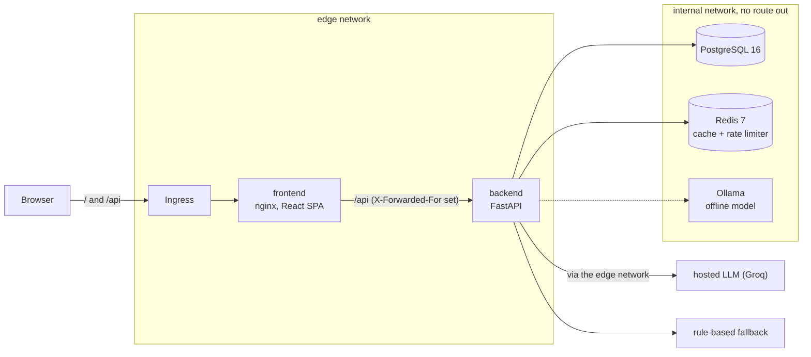
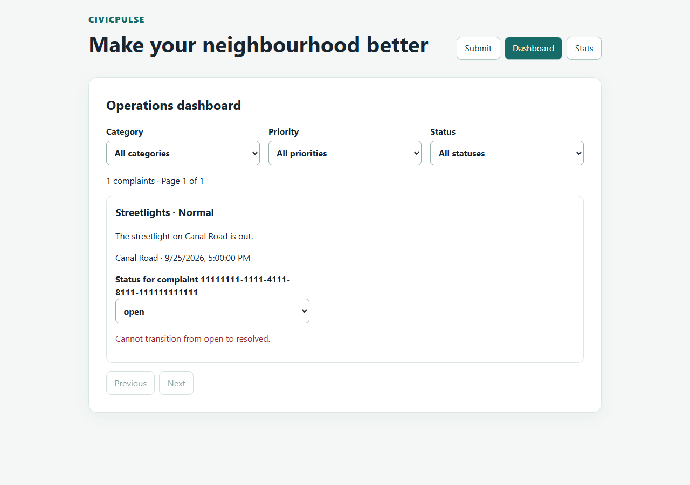
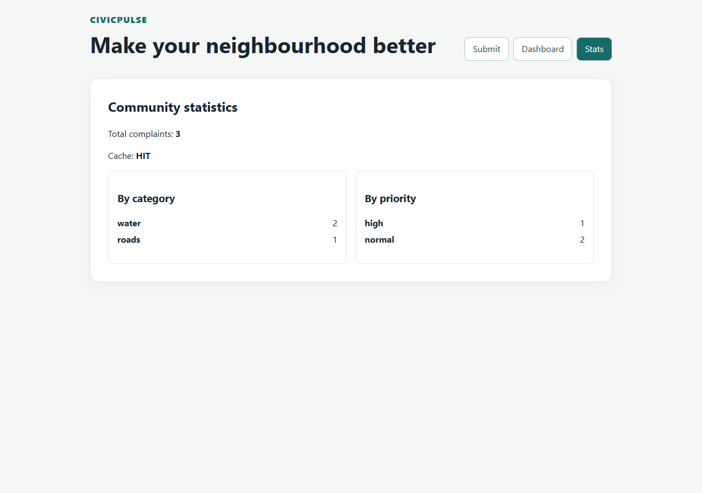
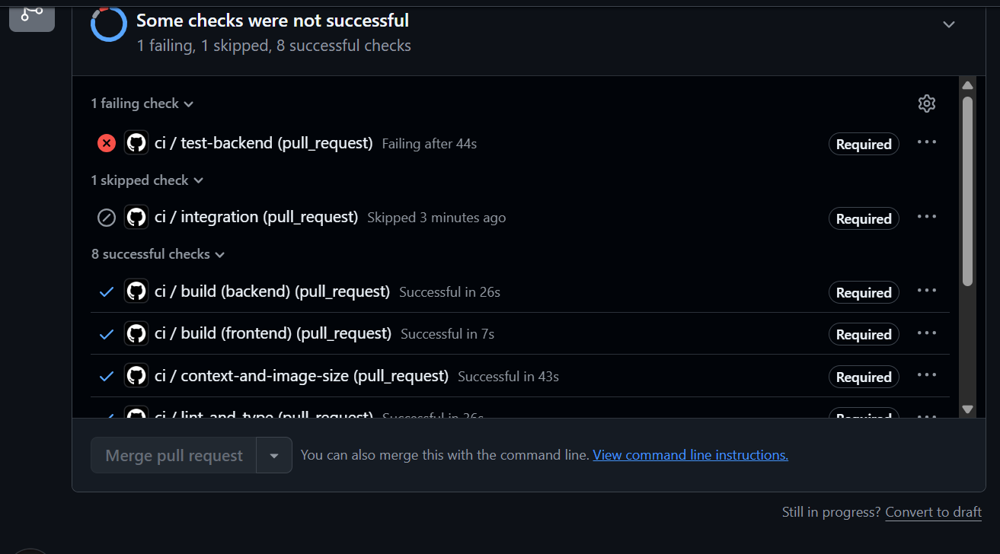
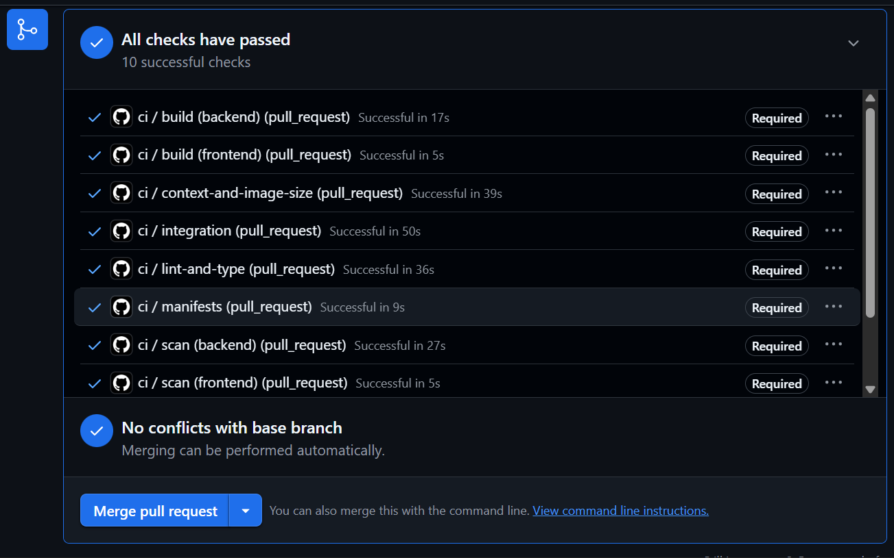

# CivicPulse

[](https://github.com/TahaSohail-Goat/Assignment1_SCD/actions/workflows/ci.yml)
[](https://github.com/TahaSohail-Goat/Assignment1_SCD/actions/workflows/cd.yml)
[](https://github.com/TahaSohail-Goat/Assignment1_SCD/actions/workflows/k8s-quickstart.yml)
[](LICENSE)

CS4032 Software Construction and Design, Assignment 1. Every claim below links to the file, run or
capture that shows it; anything not yet demonstrated is listed under [What is not shown](#what-is-not-shown).

## The problem

Citizens report civic problems (a burst pipe, a dead street light, a blocked drain) in free text.
A city office cannot read every report before it acts, so CivicPulse **triages** each complaint the
moment it arrives: it assigns a category and a priority and writes a one-line summary, stores the
complaint, and shows the office a dashboard it can filter and act on.

The reader that does the triage must be replaceable: today a keyword rule, tomorrow a hosted
language model or a local one. So the system around it must not care which one runs, and a failing,
slow or misbehaving provider must never stop a citizen from filing a complaint. That contract, and
the infrastructure around it (containers, network segmentation, Kubernetes, autoscaling, a gated
pipeline), is what this repository builds.

## Architecture



- The backend is the **only** service on both networks; the database and the cache are internal only
  and publish no port ([`compose.yaml`](compose.yaml), proof in [`docs/ENGINEERING-NOTES.md`](docs/ENGINEERING-NOTES.md) Q7).
- Layers: `routes → services → repositories / providers`. Import-scanning tests keep routes free of
  SQL and services free of HTTP ([`backend/tests/test_layering.py`](backend/tests/test_layering.py)).
- A triage provider that times out, is rate limited, returns junk or crashes never fails the request:
  the complaint is stored with `triaged_by="rules:fallback"` and one warning is logged
  ([`docs/TRIAGE.md`](docs/TRIAGE.md), [ADR 0001](docs/adr/0001-provider-interface.md)).
- Full design: [`docs/ARCHITECTURE.md`](docs/ARCHITECTURE.md), [`docs/API_DESIGN.md`](docs/API_DESIGN.md),
  [`docs/DATA_MODEL.md`](docs/DATA_MODEL.md), [`docs/CACHE.md`](docs/CACHE.md).

## Quickstart

Needs Docker with Compose v2. From a fresh clone:

```bash
cp .env.example .env && docker compose up --build
```

That builds both images, starts PostgreSQL, Redis, the backend and the frontend, applies the
migrations and loads **30 seeded complaints**. Then open <http://localhost:8080> (the web app) or
<http://localhost:8000/ready> (the API's readiness probe). `.env.example` holds placeholders; change
`POSTGRES_PASSWORD` for anything but a local trial. Stop with `docker compose down` (keeps the data)
or `docker compose down -v` (removes it).

**What proves this works:** the `integration` job of [`ci.yml`](.github/workflows/ci.yml) runs exactly these
steps on a clean runner on every pull request: it waits for `/ready`, creates a complaint, reads it
back, checks `X-Cache` goes `MISS` then `HIT`, checks the network isolation, and checks the rows survive
`docker compose down` then `up`. The commands of the [RUNBOOK](docs/RUNBOOK.md) are run there too.

### Kubernetes: the second command

Needs `docker`, [`kind`](https://kind.sigs.k8s.io/) and `kubectl`:

```bash
bash scripts/k8s-up.sh
```

It creates a kind cluster, installs ingress-nginx, metrics-server and the VPA recommender, builds and
loads the images, creates the Secret out of band (a random password, never written to the repository),
applies [`k8s/overlays/dev`](k8s/overlays/dev), seeds the database and answers through the Ingress.
Remove it with `kind delete cluster --name civicpulse`. The
[`k8s-quickstart`](.github/workflows/k8s-quickstart.yml) workflow runs this script on a clean runner, then deletes the
database pod and checks that a full-row fingerprint of the table is unchanged.

Automated deployment from `main`: [`cd.yml`](.github/workflows/cd.yml) publishes both images to GHCR tagged with
the commit SHA, emits SBOMs, and deploys those exact digests to an ephemeral kind cluster
([successful run 36230267941](https://github.com/TahaSohail-Goat/Assignment1_SCD/actions/runs/36230267941);
the first run, 36228513110, failed on a real bug that is the subject of engineering-notes question 8).

## API

| Method | Path | Purpose | Status codes |
|---|---|---|---|
| `POST` | `/api/complaints` | Validate, triage, persist | `201`, `400` field-level errors, `429` with `Retry-After` |
| `GET` | `/api/complaints` | List, newest first; filters `category`, `priority`, `status`; `page` (≥ 1), `page_size` (default 20, max 100) | `200`, `400` |
| `GET` | `/api/complaints/{id}` | One complaint | `200`, `404` |
| `PATCH` | `/api/complaints/{id}/status` | `open → in_progress` or `rejected`; `in_progress → resolved` or `rejected`; nothing leaves a final state | `200`, `400`, `404`, `409` names the forbidden transition |
| `GET` | `/api/stats` | Counts by category and priority, cached in Redis for 30 s; `X-Cache: HIT/MISS` | `200` |
| `GET` | `/api/meta/providers` | Active provider and the last 20 triage outcomes | `200` |
| `GET` | `/health` | Liveness: the process only, no dependency | `200` |
| `GET` | `/ready` | Readiness: PostgreSQL and Redis answer | `200`, `503` |
| `GET` | `/metrics` | Prometheus text | `200` |

All errors use one body, `{"error": {"code", "message", "details"}}`. The served OpenAPI document is
compared with the frontend's typed client in [`backend/tests/test_contract.py`](backend/tests/test_contract.py); print it
with `python -m app.openapi` in `backend/`. The backend is **FastAPI + Pydantic v2** (not Flask).

## Screenshots and captures

| What | Capture |
|---|---|
| A forbidden status change shows the server's own message (a `409`) |  |
| The stats view reads `X-Cache` |  |
| A red pull request cannot be merged (required check failing, merge disabled) |  |
| The same pull request after the fix: all ten required checks pass |  |
| Replicas against offered load, baseline and after applying the VPA target |  |

The first two screenshots use a controlled response at the browser's network boundary; each note
([409](docs/evidence/issue-35-409.md), [stats](docs/evidence/issue-36-stats-hit.md)) says so. The measured
`X-Cache` sequence against a real Redis is in the CI log of the `integration` job.

## What was measured

- **Tests:** the backend suite (over 300 tests, coverage above 90 % on `app/`, gate 65 %) runs on every pull
  request against a real PostgreSQL 16, with the simulated triage provider so the result never depends on a model.
- **Autoscaling:** a GET-only k6 load at 50 requests per second: the HPA went from 2 to 3 replicas, about 38 s
  after the load rose (baseline); after applying the VPA's recommended request (182m CPU) the same load kept 2
  replicas. Zero failed requests during a rolling image replacement. Method, raw captures and limits:
  [`docs/evidence/k8s-load-README.md`](docs/evidence/k8s-load-README.md).
- **Image sizes and build context:** backend context 196.61 MB without `.dockerignore`, 193.07 kB with;
  backend image 207 MB: [`docs/evidence/container-sizes.md`](docs/evidence/container-sizes.md).
- **Persistence:** deleting the database pod on Kubernetes left the same 30 rows with the same full-row
  fingerprint, a new pod UID and the same PVC UID: [`docs/evidence/k8s-pg-persistence.txt`](docs/evidence/k8s-pg-persistence.txt).

## Repository map

| Path | What is there |
|---|---|
| `backend/` | FastAPI app (`app/routes`, `services`, `repositories`, `providers/triage`), Alembic migrations, tests, Dockerfile |
| `frontend/` | React 18 + Vite + TypeScript: Submit, Dashboard and Stats views, typed API client, Vitest tests, nginx image |
| `k8s/` | Kustomize `base/` and `overlays/{dev,prod}`: Deployments, PostgreSQL StatefulSet, Redis with a PVC, Ingress, HPA, VPA (Off), PDB |
| `compose.yaml`, `compose.prod.yaml` | Development stack (build, hot reload) and deploy stack (images by `${IMAGE_TAG}`, no build) |
| `.github/workflows/` | `ci.yml` (ten required checks), `cd.yml`, `release.yml`, `k8s-quickstart.yml` |
| `load/k6-script.js` | The GET-only load used for the HPA evidence |
| `docs/` | [RUNBOOK](docs/RUNBOOK.md), [ENGINEERING-NOTES](docs/ENGINEERING-NOTES.md) (the eight questions), [ADRs](docs/adr), [AI-USAGE](docs/AI-USAGE.md), requirements and traceability |
| `scripts/` | `check_submission.py` (pre-submission lint), `k8s-up.sh` |

Every assignment requirement has an ID and a status in [`docs/ASSIGNMENT_TRACEABILITY.md`](docs/ASSIGNMENT_TRACEABILITY.md);
the authoritative assignment is [`docx/ASSIGNMENT.md`](docx/ASSIGNMENT.md).

## Working agreement

Two contributors, two GitHub accounts, separate AI assistants, all disclosed in [`docs/AI-USAGE.md`](docs/AI-USAGE.md).
Work flows issue → `feature/<n>-<slug>` → pull request into `dev` → partner review → merge; `dev` → `main`
needs one approval and the ten CI checks ([`docs/GITHUB_WORKFLOW.md`](docs/GITHUB_WORKFLOW.md), rulesets exported in
[`docs/evidence/`](docs/evidence)). Secrets never enter Git: `.env` is ignored, Kubernetes Secrets are created out
of band, and [`scripts/check_submission.py`](scripts/check_submission.py) checks the deductions of assignment section 5.3.

## What is not shown

Stated plainly, so the rest can be trusted:

- **No live hosted-LLM run.** The Groq provider is implemented and tested against controlled HTTP replies
  (timeouts, 429, malformed output, injection attempts), not measured against the live service; there is no
  hosted-versus-Ollama quality or latency comparison yet ([`docs/AI.md`](docs/AI.md), notes).
- **The demo video** has not been recorded; the captures above are the written evidence.
- The `409` and stats screenshots use controlled responses (see above).
- The autoscaling experiment ran on one developer machine (kind, Docker Desktop), through the frontend Service
  rather than an ingress controller; its VPA upper bound comes from a short observation window and is not a sizing recommendation.
- The Ollama container and the model preload are configured (`docker compose --profile offline up`) but
  were not exercised end to end in CI.
