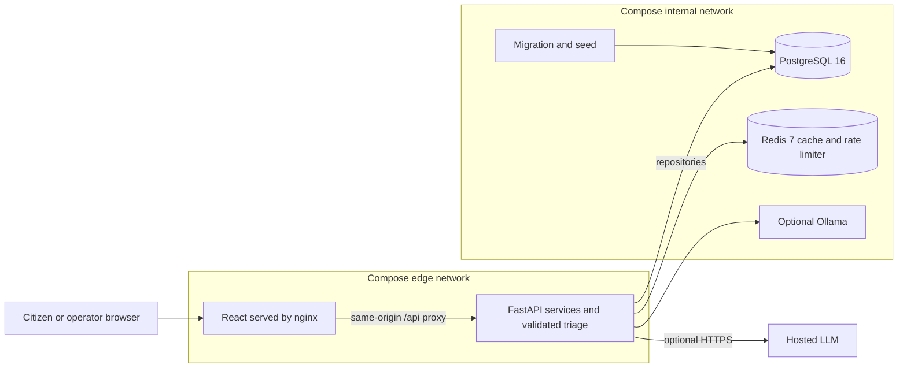
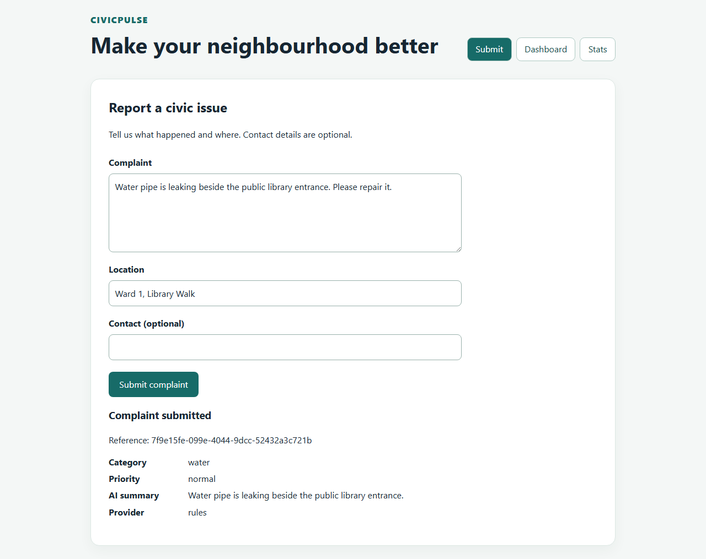
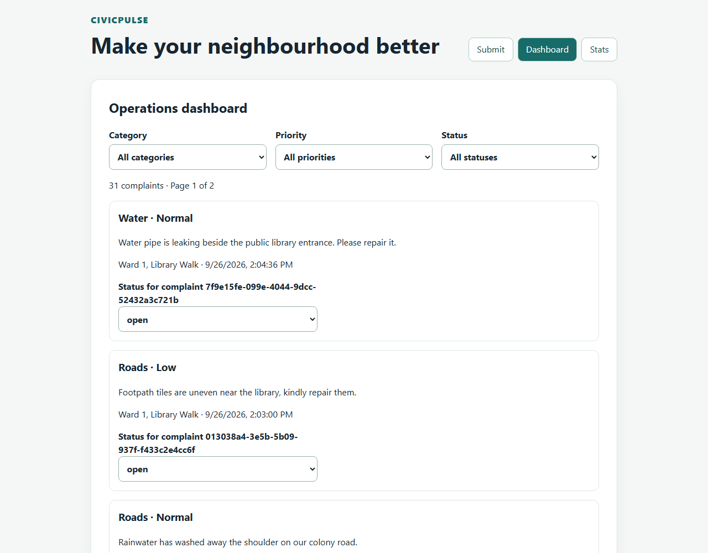
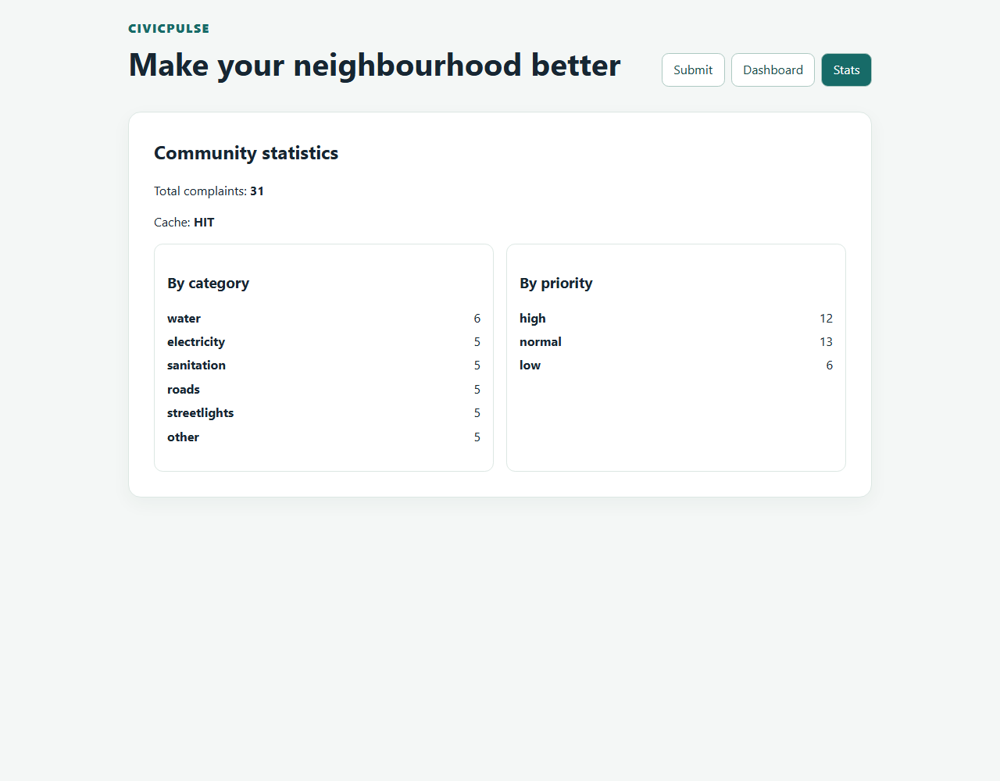

# CivicPulse

[](https://github.com/TahaSohail-Goat/Assignment1_SCD/actions/workflows/ci.yml)
[](https://github.com/TahaSohail-Goat/Assignment1_SCD/actions/workflows/cd.yml)

CivicPulse helps citizens report neighbourhood problems and operators track their resolution.
Submit a complaint and location, receive a category, priority and summary, then filter and
update complaints in the Dashboard. Stats shows category/priority totals and Redis cache state.

CS4032 Assignment 1 by **TahaSohail-Goat** and **Artfever**. Built with React 18, TypeScript,
Vite, **FastAPI** and Pydantic v2, PostgreSQL 16, Redis 7, Docker and Kubernetes.

## Clean clone: one startup command

Prerequisites: Git, Docker Desktop running **Linux containers**, Docker Compose supporting
`up --wait`, and Windows PowerShell 5.1 or later. The images supply Node 22 and Python 3.12;
no host Node/Python installation is needed for this path. The first build needs Internet.

```powershell
git clone https://github.com/TahaSohail-Goat/Assignment1_SCD.git
cd Assignment1_SCD
```

Run this **one scriptblock invocation** from the repository root. It creates a gitignored
`.env` with a generated database password if absent, builds, migrates, seeds 30 synthetic
complaints and waits for healthy services. Existing `.env` values are preserved.

```powershell
& {
    $ErrorActionPreference = 'Stop'
    if (-not (Test-Path .env)) {
        $envText = [IO.File]::ReadAllText((Join-Path (Get-Location) '.env.example'))
        [IO.File]::WriteAllText((Join-Path (Get-Location) '.env'), $envText.Replace('change-me-locally', [guid]::NewGuid().ToString('N')))
    }
    docker compose up -d --build --wait
    if ($LASTEXITCODE -ne 0) { throw 'Compose startup failed' }
}
```

Open **http://localhost:8080**; API docs are at **http://localhost:8000/docs**.
Default triage is deterministic `rules`: no key or model download is required. The default
stack has four running services plus the completed migration/seed container. Optional
Ollama adds the fifth long-running service.

Run maintenance commands separately:

```powershell
docker compose ps -a
docker compose logs --tail 50 backend
docker compose run --rm migrate python -m app.seed
docker compose down
```

Reseeding adds no duplicate seed rows. `down` retains database/Redis volumes; adding
`--volumes` would erase their data. Keep the same `.env` when reusing the database volume.
For port conflicts set `$env:FRONTEND_PORT='18080'` and `$env:BACKEND_PORT='18000'`
before startup, then use those ports in the URLs.

### Optional inference providers

For Groq, set `TRIAGE_PROVIDER=llm` and your own `GROQ_API_KEY` in `.env`, then repeat
startup. For Ollama set `TRIAGE_PROVIDER=ollama` and run
`docker compose --profile offline up -d --build --wait`. This downloads `gemma3:1b`
into a named volume first; allow extra time, disk and memory. Never commit `.env` or keys.
Hosted inference sends complaint text/location externally; use synthetic demo data.
See [provider behaviour, privacy and live-comparison limits](docs/AI.md).

## Architecture



Only the backend joins both Compose networks. The frontend cannot resolve/reach the
database; PostgreSQL and Redis publish no host ports. Status transitions live in backend
services and SQL stays in repositories. Provider output is schema-validated before storage;
the orchestrator supplies the 10-second cutoff, one retry with jitter and `rules:fallback`.
Redis caches successful triage results. [Detailed architecture](docs/ARCHITECTURE.md).

## Kubernetes: second deployment command

Install **kind** and **kubectl**, keep Docker running and complete the image build above.
This single invocation creates a separate **civicpulse-demo** cluster, installs ingress,
metrics and VPA prerequisites, loads images, creates an out-of-band Secret, deploys and
seeds. It needs Internet and memory for both stacks; stop Compose first if memory is tight.
Versions match the successful [CD workflow](.github/workflows/cd.yml).

```powershell
& {
    $ErrorActionPreference = 'Stop'
    function Run {
        $command = $args[0]
        $commandArgs = @($args | Select-Object -Skip 1)
        & $command @commandArgs
        if ($LASTEXITCODE -ne 0) { throw "Command failed: $command" }
    }
    function K { Run kubectl --context kind-civicpulse-demo @args }
    $clusters = @(Run kind get clusters)
    if ($clusters -notcontains 'civicpulse-demo') {
        Run kind create cluster --name civicpulse-demo --image kindest/node:v1.37.0 --wait 120s
    }
    K label node civicpulse-demo-control-plane ingress-ready=true --overwrite
    K apply -f https://raw.githubusercontent.com/kubernetes/ingress-nginx/controller-v1.15.1/deploy/static/provider/kind/deploy.yaml
    K apply -f https://github.com/kubernetes-sigs/metrics-server/releases/download/v0.9.0/components.yaml
    $patchFile = [IO.Path]::GetTempFileName()
    try {
        [IO.File]::WriteAllText($patchFile, '[{"op":"add","path":"/spec/template/spec/containers/0/args/-","value":"--kubelet-insecure-tls"}]')
        K -n kube-system patch deployment metrics-server --type=json --patch-file $patchFile
    } finally { Remove-Item -LiteralPath $patchFile }
    $vpa = 'https://raw.githubusercontent.com/kubernetes/autoscaler/vertical-pod-autoscaler-1.8.0/vertical-pod-autoscaler/deploy'
    K apply -f "$vpa/vpa-v1-crd-gen.yaml"
    K apply -f "$vpa/vpa-rbac.yaml"
    K apply -f "$vpa/recommender-deployment.yaml"
    K wait --for=condition=Established crd/verticalpodautoscalers.autoscaling.k8s.io --timeout=60s
    K -n ingress-nginx rollout status deployment/ingress-nginx-controller --timeout=180s
    K wait '--for=jsonpath={.webhooks[0].clientConfig.caBundle}' validatingwebhookconfiguration/ingress-nginx-admission --timeout=120s
    K -n kube-system rollout status deployment/metrics-server --timeout=120s
    Run kind load docker-image --name civicpulse-demo civicpulse-backend:dev civicpulse-frontend:dev
    K apply -f k8s/base/namespace.yaml
    $existing = @(K -n civicpulse get secret civicpulse-secrets --ignore-not-found -o name)
    if ($existing.Count -eq 0) {
        $secret = @{
            apiVersion='v1'; kind='Secret'; type='Opaque'
            metadata=@{name='civicpulse-secrets'; namespace='civicpulse'}
            stringData=@{POSTGRES_PASSWORD=[guid]::NewGuid().ToString('N'); GROQ_API_KEY='unused'}
        }
        $secret | ConvertTo-Json -Depth 4 | kubectl --context kind-civicpulse-demo apply -f -
        if ($LASTEXITCODE -ne 0) { throw 'Secret creation failed' }
    }
    K apply -k k8s/overlays/dev
    K -n civicpulse rollout status statefulset/database --timeout=180s
    K -n civicpulse rollout status deployment/cache --timeout=120s
    K -n civicpulse rollout status deployment/backend --timeout=180s
    K -n civicpulse rollout status deployment/frontend --timeout=120s
    K -n civicpulse exec deployment/backend '--' python -m app.seed
    K -n civicpulse get 'pods,hpa,vpa'
}
```

Explicit contexts confine operations to the demo cluster; kind creation also selects that
context in kubeconfig. The insecure kubelet TLS flag is for disposable kind only. VPA is
**Off** (recommendations); HPA controls 2–10 backend replicas. Metrics need time to appear.
This is a fresh-deployment recipe; local `:dev` tags are not a production release strategy.

In another terminal, expose the Ingress:

```powershell
kubectl --context kind-civicpulse-demo -n ingress-nginx port-forward service/ingress-nginx-controller 8090:80
```

Add `127.0.0.1 civicpulse.local` to your hosts file to browse **http://civicpulse.local:8090**,
or verify without a hosts edit:

```powershell
Invoke-RestMethod -Headers @{Host='civicpulse.local'} http://127.0.0.1:8090/api/stats
```

PostgreSQL uses a StatefulSet/PVC. Both app Deployments have two replicas, probes and rolling
updates; Services are ClusterIP. Production uses immutable full commit SHA tags supplied by
CD. See [load experiments](docs/evidence/k8s-load-README.md),
[persistence](docs/evidence/k8s-pg-persistence.txt) and [rollback](docs/evidence/k8s-rollback-index.md).

## API: nine method/path pairs

| Method | Path | Behaviour |
|---|---|---|
| POST | `/api/complaints` | Validate, triage, store; 201 with complaint and Location; field errors 400; limit 429 with Retry-After |
| GET | `/api/complaints` | Category/priority/status filters; page and page_size (max 100); items plus total |
| GET | `/api/complaints/{id}` | Complaint or 404 |
| PATCH | `/api/complaints/{id}/status` | 200 with updated complaint; invalid transition 409; unknown id 404 |
| GET | `/api/stats` | Category/priority totals; 30-second Redis cache; X-Cache HIT or MISS |
| GET | `/api/meta/providers` | Active provider and last 20 stored outcomes with latency/fallback |
| GET | `/health` | Process liveness |
| GET | `/ready` | PostgreSQL/Redis readiness; 503 names failed dependencies |
| GET | `/metrics` | Prometheus-format metrics |

POST accepts `text` (10–2000 characters), `location` (3–200), optional `reporter_contact`.
PATCH accepts `{"status":"in_progress"}`. Allowed transitions: open → in_progress/rejected,
and in_progress → resolved/rejected. Other transitions are rejected by the backend.
[API design](docs/API_DESIGN.md) distinguishes source rules from our response-shape decisions.
Probe/metrics/docs URLs use the backend port in Compose.

## Actual application screenshots

Captured 2026-09-26 from a fresh `dev` clone at `ba312b7`, using real PostgreSQL, Redis and
rules triage: 30 seed complaints plus one submission. No mocked responses. Dashboard shows
the first viewport; Stats shows a real cache HIT. [Capture details](docs/evidence/screenshots-README.md)
and [verification transcript](docs/evidence/screenshots-clean-clone-log.txt).

### Submit



### Dashboard



### Stats



## Checks and delivery evidence

CI covers backend lint/type checks/tests with PostgreSQL 16, frontend lint/type checks/tests/
build, container/security checks and Kubernetes validation. See [CI](.github/workflows/ci.yml)
for exact commands. `python scripts/check_submission.py` is additional submission lint,
not proof of rubric completion.

Main-branch CD gates publishing on tests, pushes both GHCR images and SBOMs, deploys the
published digests under SHA tags to an ephemeral kind cluster and smoke-tests through
Ingress. [Run 36230267941](https://github.com/TahaSohail-Goat/Assignment1_SCD/actions/runs/36230267941)
succeeded at `8074879`. The runner deletes the cluster afterwards; this is not a persistent
public deployment. Signing was waived in the [relayed instructor answers](docs/SUBMISSION.md).

Evidence: [load and rolling updates](docs/evidence/k8s-load-README.md),
[rollback](docs/evidence/k8s-rollback-index.md), [PVC persistence](docs/evidence/k8s-pg-persistence.txt),
[engineering notes Q1–Q8](docs/ENGINEERING-NOTES.md). Rollback timings are local measurements
with known-good images already available, not a universal recovery guarantee.

## Demo video and remaining handover

**The unlisted video is not recorded/uploaded yet.** Both partners must speak and the final
recording must be at most five minutes. Issue #55 stays open for the actual link.
Use real output in this recording plan:

| Time | Speaker | Show |
|---|---|---|
| 0:00–0:20 | Both | Problem and product |
| 0:20–1:10 | Taha | Fresh clone, startup and seeded Dashboard/Stats; disclose sped-up build footage |
| 1:10–2:00 | Artfever | Real AI result, provider failure with rules:fallback, prompt-injection example |
| 2:00–2:30 | Taha | Frontend-to-database network attempt fails; explain the networks |
| 2:30–3:30 | Artfever | Actual k6/HPA scaling, original timestamps and VPA recommendations |
| 3:30–4:30 | Taha | Real rollback both ways; known-good revision and measurement limits |
| 4:30–5:00 | Both | CI/CD gates and real contribution totals |

Before final submission: record/upload the video, finish the live hosted-versus-Ollama
comparison in [AI.md](docs/AI.md), merge the proposed MIT LICENSE in
[PR #99](https://github.com/TahaSohail-Goat/Assignment1_SCD/pull/99) after review, and
complete Taha's final audit/release package (#56). Recheck the 35% minimum contribution share on the final branch; current
main does not meet it. Only genuine authored work counts. The speaking split above follows
[the team agreement](docs/TEAM_CONTRIBUTION.md). A passing build alone does not complete these items.

## Project documents and contribution

- [Assignment](docx/ASSIGNMENT.md), [traceability](docs/ASSIGNMENT_TRACEABILITY.md), [document index](docs/DOCUMENT_INDEX.md)
- [Runbook](docs/RUNBOOK.md), [submission decisions](docs/SUBMISSION.md)
- [Team contribution](docs/TEAM_CONTRIBUTION.md), [AI disclosure](docs/AI-USAGE.md), [GitHub workflow](docs/GITHUB_WORKFLOW.md)

Read [AGENTS.md](AGENTS.md). Work through assigned issue → `feature/<n>-<slug>` from `dev`
→ partner-reviewed PR into `dev` → merge-commit promotion to protected `main`.
The MIT LICENSE is proposed in #99 and is not present on this branch yet.
