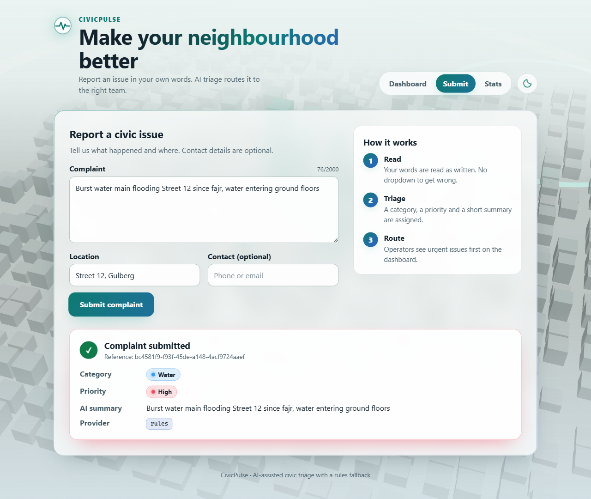
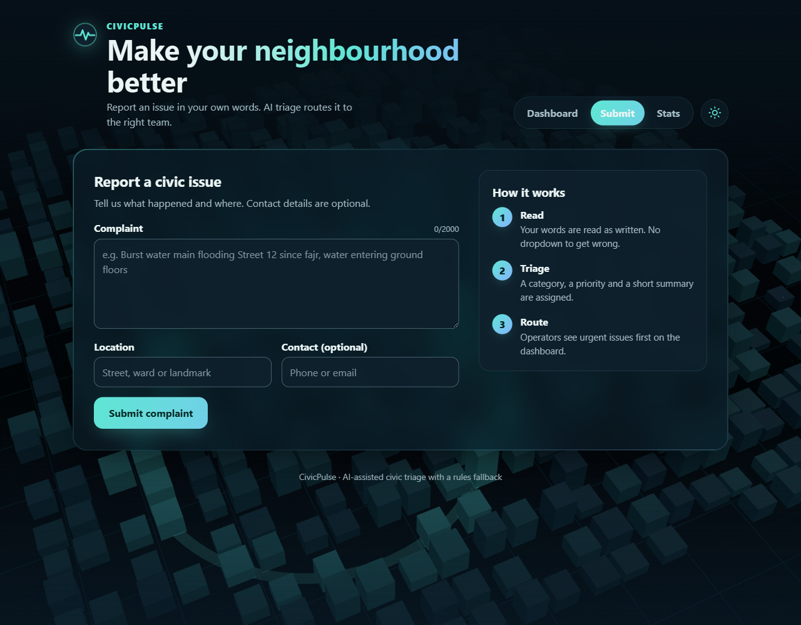
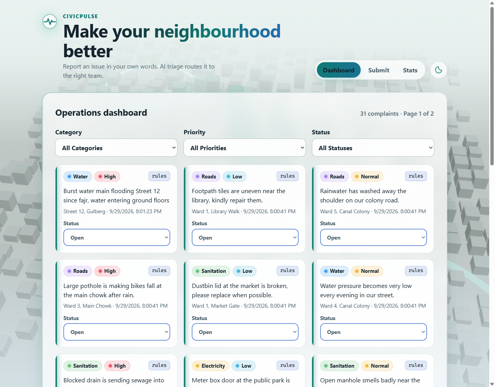
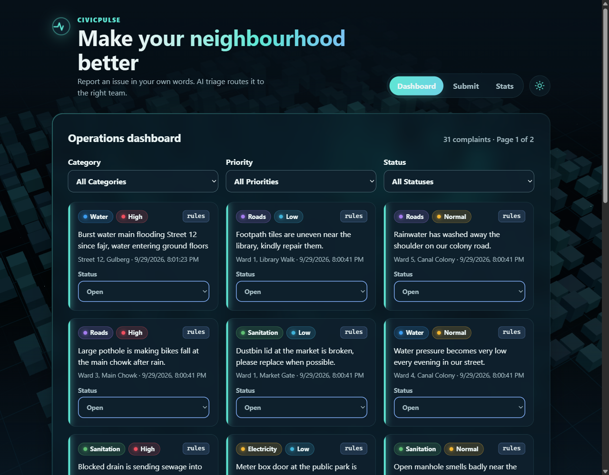
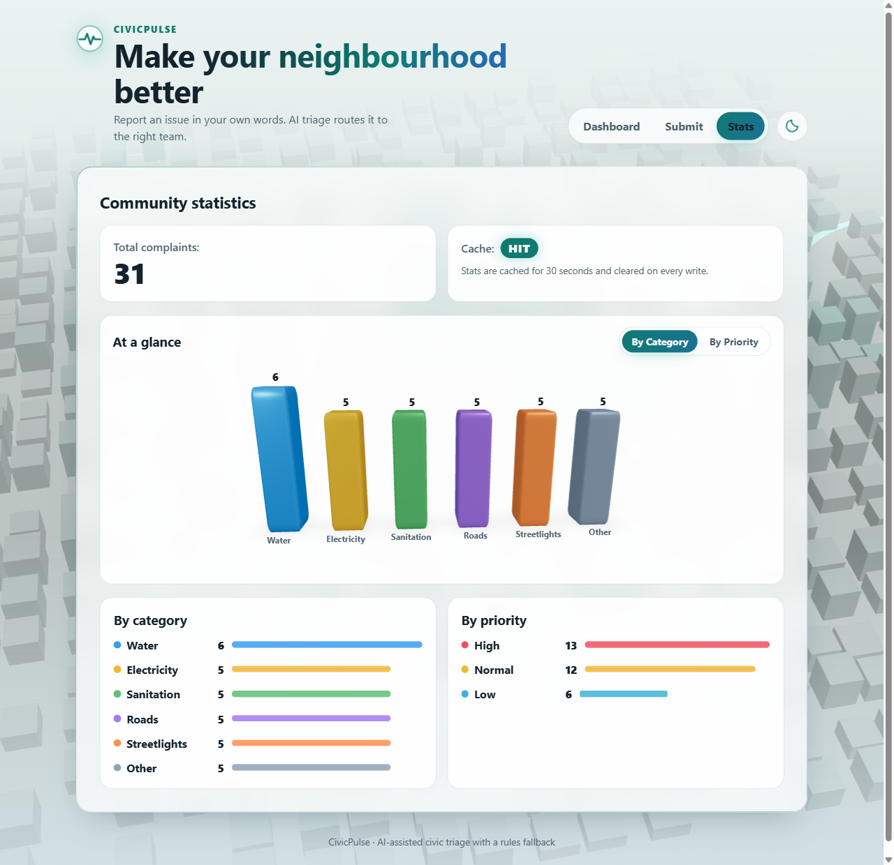
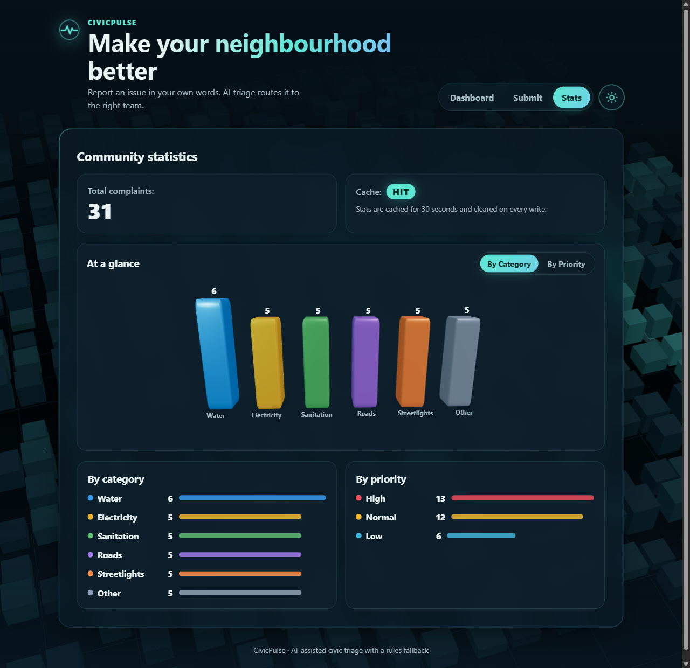
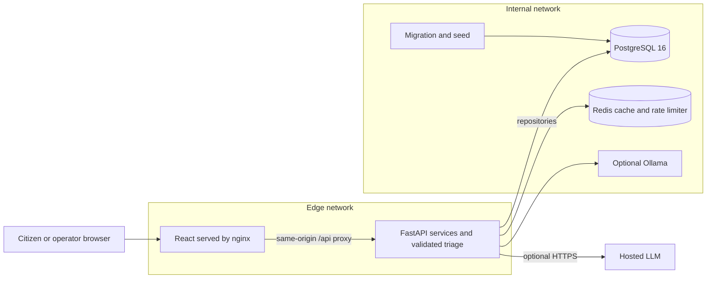

# CivicPulse

[](https://github.com/TahaSohail-Goat/Assignment1_SCD/actions/workflows/ci.yml)
[](https://github.com/TahaSohail-Goat/Assignment1_SCD/actions/workflows/cd.yml)
[](https://sonarcloud.io/summary/new_code?id=TahaSohail-Goat_Assignment1_SCD)
[](LICENSE)

**AI-assisted triage for civic complaints.** Citizens describe a problem in their own words;
CivicPulse assigns a category, a priority and a summary, stores it, and puts urgent issues in
front of operators first.

Built for CS4032 Assignment 1 by **TahaSohail-Goat** and **Artfever** with React, TypeScript,
three.js, FastAPI, PostgreSQL, Redis, Docker and Kubernetes.



## Contents

- [The problem](#the-problem)
- [Features](#features)
- [Screenshots](#screenshots)
- [Tech stack](#tech-stack)
- [Quick start](#quick-start)
- [Configure triage](#configure-triage)
- [Architecture](#architecture)
- [Repository layout](#repository-layout)
- [API](#api)
- [Frontend](#frontend)
- [Testing and quality](#testing-and-quality)
- [Operations and observability](#operations-and-observability)
- [Kubernetes](#kubernetes)
- [CI, delivery and security](#ci-delivery-and-security)
- [Evidence](#evidence)
- [Demo and submission](#demo-and-submission)
- [Documentation, contribution and license](#documentation-contribution-and-license)

## The problem

A municipal complaint form usually drops free text into one undifferentiated queue. A burst water
main can sit behind routine streetlight reports because nothing sorted them, and dropdowns do not
help: citizens pick the wrong category or cannot judge urgency. The information is in the text.

CivicPulse reads that text through a replaceable triage provider: deterministic rules by default,
a hosted or local language model when configured. The system around the provider validates every
result and falls back to rules when a model is slow, rate-limited or wrong.

## Features

| Area | Capability |
|---|---|
| Citizen workflow | Submit a complaint with a location and optional contact details; see the category, priority, summary and provider that produced them. |
| Triage | Rule-based default, optional Groq hosted provider, optional local Ollama, schema validation and safe fallback. |
| Operations | Filtered, paginated dashboard with status transitions; category/priority statistics with visible cache state. |
| Interface | Animated three.js city backdrop that pulses when a complaint is triaged, a 3D statistics chart, Motion transitions, light and dark themes. |
| Reliability | PostgreSQL persistence, Redis cache and rate limit, health/readiness probes, retry/timeout/fallback handling. |
| Deployment | Docker Compose locally; Kubernetes manifests with HPA/VPA/PDB and a gated, signed GitHub Actions delivery pipeline. |

The backend is the sole authority for validation, status transitions and triage results. The
frontend never connects to PostgreSQL or Redis.

## Screenshots

Captured from a fresh Compose stack (30 seed complaints plus one submission) with real PostgreSQL,
Redis and rules triage and no mocked responses.
[Capture details](docs/evidence/screenshots-README.md).

| View | Light | Dark |
|---|---|---|
| Submit |  |  |
| Dashboard |  |  |
| Stats |  |  |

## Tech stack

| Layer | Technology |
|---|---|
| Frontend | React 18, TypeScript, Vite, three.js with React Three Fiber and drei, Motion, served by nginx |
| Backend | Python 3.12, FastAPI, Pydantic, SQLAlchemy, Alembic |
| Data | PostgreSQL 16, Redis 7 (cache, rate limiter, triage cache) |
| AI triage | Rules, Groq (hosted LLM), Ollama (local), simulated provider for tests |
| Delivery | Docker, Compose, Kubernetes (kind), GitHub Actions, GHCR, Cosign, Trivy, kubeconform |
| Observability | Structured JSON logs, Prometheus, Grafana, OpenTelemetry with Jaeger |

## Quick start

### Prerequisites

| Tool | Why it is needed |
|---|---|
| Git | Clone the repository. |
| Docker Desktop using Linux containers | Runs the local services and supplies Node 22/Python 3.12 inside images. |
| Docker Compose with `up --wait` | Starts only after service health checks pass. |
| PowerShell 5.1+ on Windows, or a POSIX shell on macOS/Linux | Runs the commands below. |

The first build downloads container images and dependencies. No host Node or Python installation
is required for the standard Compose path.

### Start the local stack

Clone the repository and enter it:

```powershell
git clone https://github.com/TahaSohail-Goat/Assignment1_SCD.git
cd Assignment1_SCD
```

On Windows PowerShell, run this once from the repository root. It creates a gitignored `.env`
with a generated local database password when missing, then builds, migrates, seeds and waits for
healthy services. Existing `.env` values are left unchanged.

```powershell
& {
    $ErrorActionPreference = 'Stop'
    if (-not (Test-Path .env)) {
        $example = [IO.File]::ReadAllText((Join-Path (Get-Location) '.env.example'))
        [IO.File]::WriteAllText(
            (Join-Path (Get-Location) '.env'),
            $example.Replace('change-me-locally', [guid]::NewGuid().ToString('N'))
        )
    }
    docker compose up -d --build --wait
    if ($LASTEXITCODE -ne 0) { throw 'Compose startup failed' }
}
```

On macOS or Linux, use:

```bash
cp .env.example .env && docker compose up -d --build --wait
```

The Compose integration job runs that POSIX command from a clean checkout on every pull request.

### Open the application

| Service | URL | Purpose |
|---|---|---|
| CivicPulse web app | http://localhost:8080 | Submit, Dashboard and Stats views. |
| OpenAPI documentation | http://localhost:8000/docs | Interactive API reference. |
| Health endpoint | http://localhost:8000/health | Process liveness. |
| Readiness endpoint | http://localhost:8000/ready | PostgreSQL and Redis readiness. |

The default `rules` provider needs neither a key nor model download. The standard stack runs the
frontend, backend, PostgreSQL and Redis, plus the completed migration/seed job. It creates 30
synthetic seed complaints.

### Common local commands

```powershell
docker compose ps -a
docker compose logs --tail 50 backend
docker compose run --rm migrate python -m app.seed
docker compose down
```

`docker compose down` retains the database and Redis volumes. Add `--volumes` only when you want
to erase local data. If ports are busy, set `$env:FRONTEND_PORT='18080'` and
`$env:BACKEND_PORT='18000'` before starting the stack.

## Configure triage

All provider settings live in the ignored `.env` file. Never commit that file or a key.

| Mode | `.env` setting | Start command | Notes |
|---|---|---|---|
| Rules (default) | `TRIAGE_PROVIDER=rules` | `docker compose up -d --build --wait` | Deterministic and fully local. |
| Groq | `TRIAGE_PROVIDER=llm` plus `GROQ_API_KEY` | `docker compose up -d --build --wait` | Sends text and location to the configured hosted provider; use synthetic data for demos. |
| Ollama | `TRIAGE_PROVIDER=ollama` | `docker compose --profile offline up -d --build --wait` | Downloads `gemma3:1b` into a named volume; allow additional disk, time and memory. |

The service uses a 10-second provider cutoff, one jittered retry for timeout/429/5xx failures,
Pydantic output validation, a 24-hour content-hash cache and `rules:fallback` if the provider
cannot produce a safe result. Read [provider behavior and data limits](docs/AI.md) before using
a hosted provider.

## Architecture


```mermaid
flowchart LR
    browser[Citizen or operator browser] --> frontend[React served by nginx]
    subgraph edge[Edge network]
        frontend -->|same-origin /api proxy| backend[FastAPI services and validated triage]
    end
    subgraph internal[Internal network]
        backend -->|repositories| postgres[(PostgreSQL 16)]
        backend --> redis[(Redis cache and rate limiter)]
        backend --> ollama[Optional Ollama]
        migrate[Migration and seed] --> postgres
    end
    backend -->|optional HTTPS| hosted[Hosted LLM]
```

Only the backend bridges the Compose `edge` and `internal` networks. PostgreSQL and Redis have no
published production data ports, provider output is validated before storage, and business rules
stay in backend services. [Architecture details](docs/ARCHITECTURE.md) and the four ADRs explain
the design choices.

## Repository layout

```text
backend/       FastAPI application, Alembic migrations, repositories and tests
frontend/      React/Vite interface, three.js scenes, typed API client and component tests
k8s/           Base manifests plus dev and production overlays
observability/ Prometheus and Grafana provisioning
scripts/       Kubernetes, GitOps and submission helpers
docs/          Assignment traceability, runbooks, ADRs and authentic evidence
.github/       CI, CD, release and Kubernetes quickstart workflows
```

The required repository inventory is maintained in [REPOSITORY_STRUCTURE.md](docs/REPOSITORY_STRUCTURE.md).

## API

| Method | Path | Behavior |
|---|---|---|
| POST | `/api/complaints` | Validate, triage and store; returns 201 and a Location header. |
| GET | `/api/complaints` | Filter by category/priority/status and paginate stored complaints. |
| GET | `/api/complaints/{id}` | Return one complaint or 404. |
| PATCH | `/api/complaints/{id}/status` | Update status; invalid transition is 409 and unknown ID is 404. |
| GET | `/api/stats` | Category/priority totals with a 30-second Redis cache and `X-Cache`. |
| GET | `/api/meta/providers` | Active provider and recent stored provider outcomes. |
| GET | `/health` | Process liveness. |
| GET | `/ready` | PostgreSQL/Redis readiness; names failed dependencies on 503. |
| GET | `/metrics` | Prometheus-format metrics. |

`POST /api/complaints` accepts `text` (10-2000 characters), `location` (3-200) and optional
`reporter_contact`. `PATCH /api/complaints/{id}/status` accepts `{"status":"in_progress"}`.
Allowed transitions are `open` to `in_progress`/`rejected` and `in_progress` to
`resolved`/`rejected`. [API design](docs/API_DESIGN.md) records response-shape decisions.

## Frontend

The interface has three views: **Submit**, **Dashboard** and **Stats**.

- **3D layer:** a low-poly city rendered with three.js through React Three Fiber. Pulse waves cross
  it continuously, and a successful submission sends a larger pulse coloured by the returned
  priority. The Stats view adds a 3D bar chart with a category/priority switch.
- **Animation:** Motion drives page transitions, the navigation pill, staggered cards, loading
  skeletons, the triage scan bar and count-up totals.
- **Fallbacks:** the 3D scenes load lazily and only with hardware WebGL and no reduced-motion
  preference. Without WebGL, on software rendering (SwiftShader, llvmpipe) or with reduced motion,
  the same views use a static background. Every number also appears as accessible text.
- **Runtime configuration:** nginx proxies `/api` to the backend, so one image runs in any
  environment ([ADR 0002](docs/adr/0002-frontend-runtime-config.md)).

To work on the interface with hot reload, keep the Compose backend running and start Vite:

```powershell
cd frontend
npm ci
npm run dev
```

Vite serves http://localhost:5173 and proxies `/api` to the backend on port 8000.

## Testing and quality

| Check | Command | Where it runs |
|---|---|---|
| Backend unit and integration tests, coverage gate 65% | `cd backend; pip install -r requirements-dev.txt; pytest` | CI `test-backend` |
| Frontend component tests | `cd frontend; npm ci; npm test` | CI `test-frontend` |
| Lint, type check, API contract | `npm run lint`, `npm run typecheck`, `npm run check:api-contract` | CI `lint-and-type` |
| Compose end-to-end smoke test | `docker compose up -d --build --wait` from a clean checkout | CI `integration` |
| Submission lint | `python scripts/check_submission.py` | Locally, before submitting |

Pull requests also run Trivy image scans, kubeconform manifest validation and SonarCloud analysis.

## Operations and observability

### Prometheus and Grafana

Set `GRAFANA_ADMIN_PASSWORD` in `.env`, then start the optional profile:

```powershell
docker compose --profile observability up -d --build --wait
```

Prometheus is available at http://127.0.0.1:9090 and Grafana at
http://127.0.0.1:3000/d/civicpulse/civicpulse-operations. The profile is local-only. See the
[operations runbook](docs/RUNBOOK.md#16-optional-prometheus-and-grafana-asg-bonus-004) and the
[authentic Grafana capture](docs/evidence/observability-grafana-dashboard.png).

### OpenTelemetry and Jaeger

Use the optional tracing profile to inspect browser, API and provider spans locally:

```powershell
$env:OTEL_EXPORTER_OTLP_TRACES_ENDPOINT='http://jaeger:4318/v1/traces'
$env:VITE_OTEL_EXPORTER_OTLP_TRACES_ENDPOINT='http://127.0.0.1:4318/v1/traces'
docker compose --profile tracing up -d --build --wait
```

Submit synthetic data, then open http://127.0.0.1:16686. The collector and viewer bind only to
loopback, and trace attributes exclude complaint content, contact details, provider payloads and
credentials. See the [captured browser-to-provider trace](docs/evidence/otel-trace.png) and
[tracing runbook](docs/RUNBOOK.md#17-optional-opentelemetry-tracing-asg-bonus-005).

## Kubernetes

### Prerequisites

Install `kind` and `kubectl`, keep Docker running, and build the Compose images first. The local
cluster is named `civicpulse-demo`; it is separate from the Compose stack.

### Deploy and verify

On macOS/Linux, or from Git Bash/WSL on Windows, run the maintained deployment command:

```bash
bash scripts/k8s-up.sh
```

The script creates the cluster, installs ingress/metrics/VPA prerequisites, loads the local images,
creates the runtime Secret outside Git, deploys the dev overlay, waits for probes and seeds data.
It is exercised by the [k8s-quickstart workflow](.github/workflows/k8s-quickstart.yml).

Expose the Ingress in another terminal:

```powershell
kubectl --context kind-civicpulse-demo -n ingress-nginx port-forward service/ingress-nginx-controller 8090:80
```

Browse http://civicpulse.local:8090 after adding `127.0.0.1 civicpulse.local` to your hosts file,
or query without a hosts-file edit:

```powershell
Invoke-RestMethod -Headers @{Host='civicpulse.local'} http://127.0.0.1:8090/api/stats
```

PostgreSQL uses a StatefulSet/PVC. Both app Deployments have two replicas, probes and rolling
updates; Services are ClusterIP. HPA controls 2-10 backend replicas and VPA runs in recommendation
mode. Detailed setup, rollback and limitations are in [RUNBOOK.md](docs/RUNBOOK.md).

### Optional GitOps

After the Kubernetes quickstart, install the local Argo CD demonstration:

```powershell
powershell -NoProfile -ExecutionPolicy Bypass -File scripts/argocd-gitops-demo.ps1
```

It reconciles the repository's `dev` overlay with automated prune and self-heal while keeping the
runtime Secret outside Git. [GitOps evidence and limits](docs/evidence/argocd-gitops-README.md).

## CI, delivery and security

Pull requests run linting, type checking, backend/frontend tests, image builds, vulnerability
scans, manifest validation and Compose integration. Pushes to protected `main` run the same gates,
publish immutable GHCR images, produce SBOMs, keylessly sign and verify image digests, deploy to an
ephemeral kind cluster and perform an Ingress smoke test.

Latest main [CD 36584542080](https://github.com/TahaSohail-Goat/Assignment1_SCD/actions/runs/36584542080)
passed those gates at `bfe599a`. The workflow deletes its cluster after the smoke test; this is
deployment evidence, not a persistent public hosting service.

Security controls include ignored environment files, non-root pinned images, network segmentation,
schema validation, rate limiting, signed immutable deployment references and protected branches.
Read the [security baseline](docs/SECURITY.md), [CI/CD guide](docs/CICD.md) and
[Cosign verification evidence](docs/evidence/cosign-verification.md).

## Evidence

All captures are authentic and kept under [`docs/evidence/`](docs/evidence/):

- [Screenshot capture details](docs/evidence/screenshots-README.md) and the original
  [clean-clone verification transcript](docs/evidence/screenshots-clean-clone-log.txt)
- [Load test, HPA scaling and zero-downtime rolling updates](docs/evidence/k8s-load-README.md)
- [Rollback](docs/evidence/k8s-rollback-index.md) and [PVC persistence](docs/evidence/k8s-pg-persistence.txt)
- [Provider comparison](docs/evidence/provider-comparison-README.md)
- [Argo CD GitOps](docs/evidence/argocd-gitops-README.md),
  [Grafana dashboard](docs/evidence/observability-grafana-dashboard.png) and
  [OpenTelemetry trace](docs/evidence/otel-trace.png)
- [Engineering notes](docs/ENGINEERING-NOTES.md) answering the assignment questions

## Demo and submission

- [YouTube demo (unlisted)](https://youtu.be/bExMGzoHYow)
- [Google Drive backup](https://drive.google.com/file/d/1uNGCvKnzy_vpxxolNp6qQp8R4ht3Ip58/view?usp=drive_link)
- [Submission package and links](docs/SUBMISSION.md)
- [Video verification and scope](docs/evidence/submission-final-README.md)

The video is 4:38 and demonstrates fresh-clone startup, hosted triage, fallback, network
isolation, HPA scaling and both rollback methods. Historical rubric caveats remain recorded in the
[final checklist](docs/FINAL_SUBMISSION_CHECKLIST.md).

## Documentation, contribution and license

Start with the [document index](docs/DOCUMENT_INDEX.md), then consult
[assignment traceability](docs/ASSIGNMENT_TRACEABILITY.md), [runbook](docs/RUNBOOK.md),
[team contribution agreement](docs/TEAM_CONTRIBUTION.md), [AI usage disclosure](docs/AI-USAGE.md)
and [GitHub workflow](docs/GITHUB_WORKFLOW.md).

Changes follow issue to feature branch to partner-reviewed PR into `dev`, followed by a
merge-commit promotion to protected `main`. The project is licensed under the
[MIT License](LICENSE).
