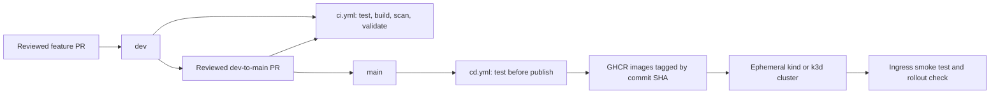
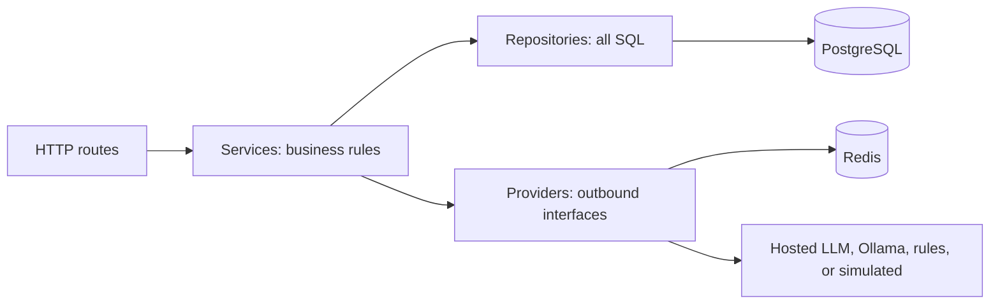
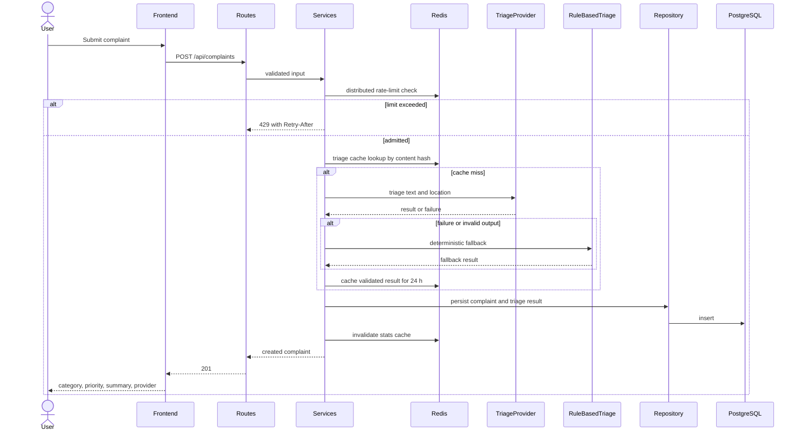
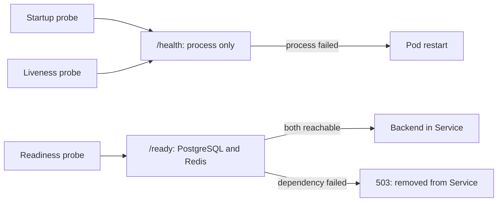

# Architecture

This document maps the assignment's architecture (§2–§3, PDF pp3–18) to implementation boundaries. **Fixed** means the source states the rule; **decision** means the team selected one permitted design. API shapes and unresolved API details belong to [API_DESIGN.md](API_DESIGN.md), not to this document.

## Components and network topology

```mermaid
flowchart LR
    Person[Citizen or operator] -->|HTTP| Frontend
    subgraph Edge[Compose edge network]
        Frontend[Frontend: nginx and React]
        Backend[Backend: FastAPI]
        Frontend -->|proxy /api| Backend
    end
    subgraph Internal[Compose internal network: internal true]
        Postgres[(PostgreSQL 16: pgdata)]
        Redis[(Redis 7: cache and rate limiter)]
        Ollama[Ollama: offline provider]
    end
    Backend -->|SQL through repositories| Postgres
    Backend -->|cache and rate limits through providers| Redis
    Backend -->|offline triage option| Ollama
    Backend -->|hosted triage via edge egress| Hosted[Hosted LLM]
```

**Fixed:** the frontend joins only `edge`; PostgreSQL and Redis join only `internal`; the backend joins both and is the sole bridge (§3.2 p13, `ASG-DEVOPS-013…017`). There is no frontend-to-database route. Phase 08 must demonstrate `docker compose exec frontend ping database` failing and must publish no database or cache port in production (`ASG-DEVOPS-017`, `ASG-DED-005/006`). Putting the offline Ollama service on `internal` is a **decision**: it needs backend access but no public ingress.

**Hosted LLM caller placement — decision (`ASG-DEVOPS-018`).** Keep the hosted caller inside the backend's provider implementation. The backend is already on `edge`, giving it an outbound HTTPS path, while its PostgreSQL and Redis connections stay on `internal`. Do not attach data services or the frontend to another network for LLM access. This preserves the assignment's sole bridge and avoids a new gateway service. The trade-off is that one backend process has both data access and egress: provider credentials stay server-side, ADR 0004 controls what complaint data may leave, and Phase 08 must verify real egress and isolation instead of assuming dual network membership chooses the intended route. A separate egress adapter on `edge` is possible, but adds a service and an internal API that must handle complaint data. §3.2 p13 explicitly leaves placement open; engineering-notes question 7 (§5.2 p24) records the measured answer.

Kubernetes has one Ingress host (`/` to frontend, `/api` to backend) and four ClusterIP Services (§3.3 p14, `ASG-K8S-008/009`). PostgreSQL is a StatefulSet with a PVC; Redis has a PVC. ClusterIP prevents external publication; it does **not** itself establish pod-to-pod isolation. The Compose isolation proof must not be presented as evidence of a Kubernetes NetworkPolicy that the assignment does not specify.

## Build and deployment path

This is the required `dev`/`main` separation and the assignment's CI/CD sequence (§3.4 p17–18). Publishing and deployment jobs depend on passing tests; a PR build does not publish. The deployed reference is an immutable SHA or digest, never `:latest` (`ASG-CICD-002/003/011…023`). The diagram is a planned pipeline, not evidence that workflows or a cluster already exist; #51 and #52 implement it.

## Backend dependency direction

**Fixed:** routes → services → repositories/providers (§2.2 p5, `ASG-NFR-002…007`). Routes parse, validate and serialize HTTP; they neither open database sessions nor decide state transitions. Services own the explicit state machine, triage orchestration and statistics. All SQL stays in repositories. Providers isolate LLM and cache calls behind interfaces. The frontend uses a typed HTTP client and does not duplicate backend business rules (§2.1 p4, `ASG-FR-013`).

## Submit and statistics flows

The 201/429 outcomes and components come from §2.2, §2.4 and §2.5 (`ASG-FR-020`, `ASG-CACHE-007…009`, `ASG-AI-010…016`). Every model result is schema-validated before use; malformed output or provider failure leads to the deterministic rule fallback, not directly to persistence. The assignment fixes a 10 s timeout, one jittered retry on timeout/429/5xx, and no retry on 400 (§2.5 p11). The exact JSON and Redis-down behavior are **design decisions** in [API_DESIGN.md](API_DESIGN.md). A failed persistence operation cannot be reported as a created complaint.

For `GET /api/stats`, the service first reads Redis. A hit returns aggregates with `X-Cache: HIT`; a miss aggregates through the repository from PostgreSQL, writes the Redis entry with a 30 s TTL, and returns `X-Cache: MISS` (§2.4 p8, `ASG-CACHE-002…005`). A new complaint invalidates the entry. Redis also holds the distributed rate limiter; PostgreSQL is the durable source of complaints. Alembic owns schema changes (§2.3 p7–8).

## Probes and failure paths

`/health` must not touch the database; `/ready` returns 200 only when **both** PostgreSQL and Redis are reachable, otherwise 503 naming the failed dependency (§2.2 p6, §3.3 p15, `ASG-FR-031/032`). A dependency outage must not make liveness restart every pod. The startup probe tolerates slow boot. Compose healthchecks and `depends_on: condition: service_healthy` govern startup ordering (§3.2 p13); readiness remains a runtime check.

| Failure | Required or decided behavior | Basis |
|---|---|---|
| Hosted provider timeout, 429 or 5xx | Retry once with jitter, then validate or fall back to rules; record `rules:fallback` when used. A provider failure must not give the citizen a 500. | Fixed, §2.5 p11–12 |
| Malformed provider output | Reject at schema validation and use rule fallback. | Fixed, §2.5 p11–12 |
| Redis unreachable | `/ready` names Redis and returns 503. Request-time limiter/cache behavior follows DQ-API-15. | Fixed readiness; request behavior is a decision in API_DESIGN.md |
| PostgreSQL unreachable | `/ready` names PostgreSQL and returns 503. A write cannot claim success without persistence; other response details stay with API design. | Fixed readiness, §2.2 p6; persistence invariant |
| Backend process fails | `/health` fails and liveness restarts the pod; startup failure is handled by the startup probe. | Fixed, §3.3 p15 |

## Decisions and owning packages

| Decision or record | Where it belongs | Package |
|---|---|---|
| Hosted caller placement and measured egress/isolation result | This document now; engineering-notes question 7 after testing | #32, then #54 |
| Error bodies, pagination, provider metadata and other API gaps | [API_DESIGN.md](API_DESIGN.md), DQ-API-01…18 | #33 |
| Provider interface and fallback structure | [ADR 0001](adr/0001-provider-interface.md) | #46 with #44 implementation |
| Frontend `/config.js` versus nginx `/api` proxy | [ADR 0002](adr/0002-frontend-runtime-config.md) | #34 |
| Immutable image reference and deployment | [ADR 0003](adr/0003-deploy-by-sha.md) | #52 |
| Complaint data allowed to leave for a hosted provider | [ADR 0004](adr/0004-pii-and-data-governance.md) | #46 |
| Helm instead of the prescribed Kustomize layout, if chosen | Additional ADR before changing manifests | #49 |

The layout audit and migration steps are in [REPOSITORY_STRUCTURE.md](REPOSITORY_STRUCTURE.md). Diagrams describe intended boundaries; enforcement and evidence arrive in the owning implementation packages.
