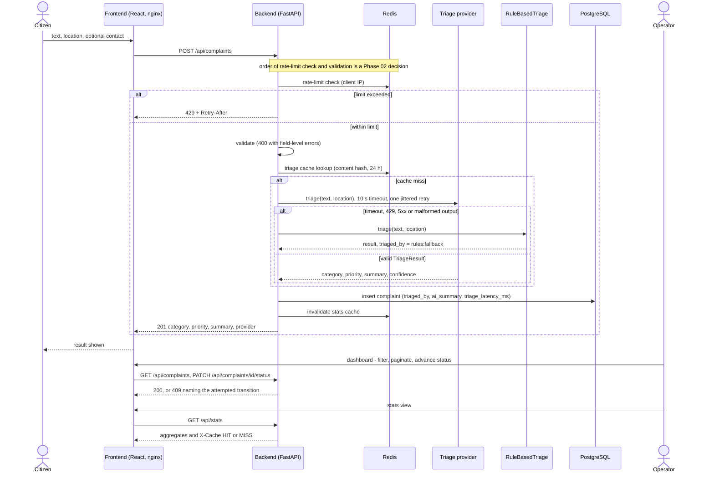
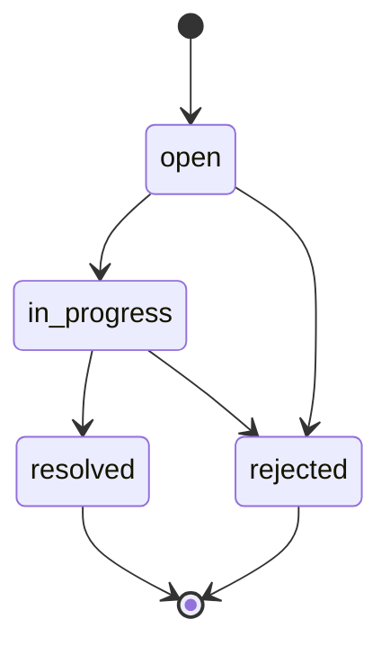

# Product Requirements Document — CivicPulse

| | |
|---|---|
| **Phase / issue** | Phase 01 · #13 (parent #12) |
| **Author / reviewer** | `TahaSohail-Goat` / `Artfever` |
| **Source of truth** | [`docx/ASSIGNMENT.md`](../docx/ASSIGNMENT.md) (transcription of `docx/ASSIGNMENT_SOURCE.pdf`). References look like `§2.2 p5` (section, PDF page). |
| **IDs** | `ASG-*` requirement IDs from [`ASSIGNMENT_TRACEABILITY.md`](ASSIGNMENT_TRACEABILITY.md). Nothing in this document is invented; what the assignment leaves open is listed in §6.2 and §13. |

## 1. Product problem

- A citizen reports a problem such as *"burst water main flooding Street 12 since fajr, water entering ground floors"* as free text in a form. The text lands in an **undifferentiated queue**; on a Monday it is "four hundred items long" and the burst main waits behind three streetlight complaints "because nothing sorted them" (§1.1 p1).
- The naive fix, a category dropdown, fails: citizens pick wrong, pick "Other" to finish faster, and cannot judge urgency. "The information is in the text. Somebody has to read it." (§1.1 p1)
- The engineering problem is **not the reading; it is that the reader must be replaceable** — a keyword rule today, a language model tomorrow, a fine-tuned classifier next year. The surrounding system must not care which, and must not fail when the clever one is rate-limited, slow or wrong (§1.1 p1). This is the requirement behind `ASG-AI-*`.

## 2. Product outcome

**CivicPulse** is an end-to-end municipal complaint intake, triage and operations platform (§1.2 p1–2; the product may be renamed but the §2 contracts must be kept — `ASG-GEN-004`).

1. A citizen submits a complaint through a web interface.
2. The system validates it and **triages it into a category, a priority and a one-line summary**, persists it durably, and shows it on a live operations dashboard with aggregate statistics (`ASG-FR-037`).
3. The system runs as five cooperating containers on a laptop with one command (`ASG-GEN-005`) and as a scaled, probed, auto-scaling workload on a Kubernetes cluster in CI (`ASG-GEN-006`).

**"Done" is defined by the assignment (§1.4 p3):**

| Condition | ID |
|---|---|
| A stranger clones the repository and, with one command, has the whole system running **with seeded data** | `ASG-GEN-007` |
| A second command puts it on a Kubernetes cluster | `ASG-GEN-008` |
| A push to main tests it, builds signed and scanned images, deploys them, and can be **undone in thirty seconds** (image signing is not required, per the instructor) | `ASG-GEN-009`, `ASG-CICD-031` |
| Everything a claim in the README asserts can be demonstrated | `ASG-GEN-010` |

Why each piece exists (§1.3 p2): a real frontend forces CORS, a build step, runtime configuration and a multi-stage image; an AI step "you do not control" forces structured output, validation, timeouts, retry, fallback, cost caching and rate limiting; PostgreSQL with migrations forces persistence, volumes and StatefulSets; Redis doing two jobs forces cache semantics and a distributed limiter; two Docker networks force segmentation; Kubernetes with an HPA forces declarative operations and resource requests.

## 3. Users and actors

Only the citizen and the operator are **users of the product**: the complaint workflow in §4 involves the citizen, the operator and the triage provider. The other actors are listed because requirements in later families need an actor, and the assignment itself frames "done" and grading around them. They are kept out of the workflow.

### 3.1 Users in the complaint workflow

| Actor | Kind | What they do | Source |
|---|---|---|---|
| **Citizen** | human | Submits a free-text complaint, a location and an optional contact; sees the returned category, priority, AI summary and which provider produced it | §1.2 p2, §2.1 p4 |
| **Operator** | human | Uses the dashboard: paginated, filterable list (category, priority, status); advances a complaint's status; reads aggregate counts and whether they came from the cache | §2.1 p4 |

### 3.2 Systems the workflow depends on

| Actor | Kind | What they do | Source |
|---|---|---|---|
| **Triage provider** | external, replaceable | *The reader.* Hosted free-tier LLM (Groq recommended primary, Google AI Studio/Gemini recommended alternative, others acceptable if free and documented); Ollama container (offline); rule-based fallback; simulated provider for CI | §2.5 p9–10 |
| **Platform automation** | system | CI/CD workflows, the Kubernetes control plane, HPA and VPA acting on the deployed system | §3.3–3.4 p14–19 |

*Platform automation* is the actor of the probe, autoscaling and pipeline requirements: for example `/health` and `/ready` are called by Kubernetes probes and the Compose healthcheck (`ASG-FR-031/032`), and `ASG-K8S-*`, `ASG-DEVOPS-*` and `ASG-CICD-*` describe what the platform does to the system.

### 3.3 Stakeholders (they judge the delivery; they do not use the product)

| Actor | Kind | What they do | Source |
|---|---|---|---|
| **Stranger / evaluator** | human | Clones the repository, runs one command, reads the README, watches the demo, grades against the rubric, and examines each student individually at the viva | §1.4 p3, §5.4 p24–25, §5.8 p26 |

The *stranger / evaluator* is the actor of the handover requirements: "a stranger clones your repository and, with one command, has the whole system running" (§1.4 p3, `ASG-GEN-007…010`), and the person who grades and examines each student (§5.4, §5.8).

The assignment defines **no login, roles or permissions**: nothing distinguishes an operator from a citizen at the API level (see §6.2).

## 4. End-to-end complaint workflow

Steps come from §2.1–§2.5 and §1.2; nothing else is assumed. The detailed flows, including the alternate and failure paths, are the use cases in [`USE_CASES.md`](USE_CASES.md) (issue #17).

1. The citizen fills the submission form. Client-side validation mirrors the server's rules without replacing them (`ASG-FR-004/005`).
2. `POST /api/complaints` is guarded by the distributed, IP-keyed rate limiter in Redis; an exceeded limit answers **429 with `Retry-After`** (`ASG-CACHE-007…009`).
3. The backend validates the input; invalid input answers **400 with field-level errors** (`ASG-FR-021`).
4. Triage: a Redis cache keyed by content hash (24 h TTL) answers duplicates; otherwise the selected provider is called with a **10 s timeout** and **one jittered retry on timeout/429/5xx** (never on 400); its output is validated against `TriageResult` (`ASG-AI-010…016`).
5. If the provider fails or returns malformed output, `RuleBasedTriage` decides, `triaged_by = "rules:fallback"` is recorded, one WARNING is logged, and **the user never sees a 500** (`ASG-AI-015`, `ASG-NFR-011`).
6. The complaint is persisted in PostgreSQL with `triaged_by`, `ai_summary` and `triage_latency_ms`; the stats cache is **invalidated on write** (`ASG-DATA-005…015`, `ASG-CACHE-005`).
7. The API answers **201**; the UI shows category, priority, AI summary and provider (`ASG-FR-006`), having shown an honest loading state meanwhile (`ASG-FR-007`).
8. The operator lists, filters and pages complaints and advances a status with `PATCH`; an invalid transition answers **409 naming the attempted transition**, and the UI shows that message verbatim (`ASG-FR-008…010`, `ASG-FR-027/028`).
9. The stats view calls `GET /api/stats` (read-through cache, TTL 30 s) and displays `X-Cache: HIT` or `MISS` (`ASG-FR-011/012`, `ASG-CACHE-002…004`).

Status lifecycle (`ASG-FR-034`, §2.2 p6): `resolved` and `rejected` are terminal; every other transition is 409.

## 5. Scope

Every row is mandatory unless marked optional. Rubric marks are from §4 (their total is inconsistent in the source: 175 vs the stated 150; the instructor left the rubric to the teaching assistant).

| Area | What is in scope | IDs | Rubric part (marks) |
|---|---|---|---|
| Frontend | React 18 + Vite + TypeScript; Submit, Dashboard and Stats views; typed API client; error boundary; runtime configuration without a baked-in API URL; ≥ 5 component tests | `ASG-FR-001…017`, `ASG-NFR-014` | B (18) |
| Backend | Nine endpoints; four layers; explicit state machine; health vs readiness; JSON logging with `request_id`; graceful SIGTERM; ≥ 14 tests, ≥ 65% coverage | `ASG-FR-020…037`, `ASG-NFR-002…013` | C (25) |
| Data | PostgreSQL 16, Alembic migrations, minimum schema, two indexes, idempotent seed of ≥ 30 complaints, persistence across restarts | `ASG-DATA-001…023` | D (12) |
| Cache | Redis 7: stats cache (TTL 30 s, `X-Cache`, invalidation on write), distributed rate limiter, AOF on a named volume | `ASG-CACHE-001…012` | E (10) |
| AI | `TriageProvider` interface, four implementations chosen by `TRIAGE_PROVIDER`, structured output + validation, timeout, retry, fallback, content-hash cache, prompt-injection guardrail, latency recording, PII ADR | `ASG-AI-001…025` | F (25) |
| Docker / Compose | Two multi-stage, pinned, non-root images; two networks (`internal: true`); three named volumes; healthchecks; `compose.yaml` and `compose.prod.yaml` | `ASG-DEVOPS-001…029` | G (15) |
| Kubernetes | Kustomize base + overlays; namespace `civicpulse`; Deployments, StatefulSet, Services, Ingress, ConfigMap/Secret (placeholders), probes, HPA v2, VPA (Off), PDB; load test evidence | `ASG-K8S-001…030` | H (20) |
| CI/CD | `ci.yml`, `cd.yml`, `release.yml`; gated publish; GHCR by SHA; SBOM; ephemeral cluster deploy; rollback two ways | `ASG-CICD-001…031` | I (20) |
| Collaboration | Protected main, `dev` + feature branches, ≥ 5 reviewed PRs, ≥ 35 commits with neither partner below 35%, one deliberate real merge conflict | `ASG-GH-001…011` | A (15) |
| Documentation | README, four ADRs, RUNBOOK, ENGINEERING-NOTES (eight questions), AI-USAGE, demo video | `ASG-DOC-001…028` | J (15) |
| **Bonus (optional, capped +15)** | Zero-downtime rollout under load (+4), GitOps (+4), digest + Cosign (+3), Prometheus/Grafana (+2), OpenTelemetry (+2) | `ASG-BONUS-001…008` | +15 |

Repository layout is fixed by §5.7 (`ASG-REPO-001…019`, [`REPOSITORY_STRUCTURE.md`](REPOSITORY_STRUCTURE.md)). Order of value if time is short: **F > C > I > H**, and never skip the fallback test (§5.1 p23, `ASG-GEN-012`, `ASG-AI-022`).

## 6. Non-goals

### 6.1 Stated by the assignment

| Non-goal | Source |
|---|---|
| The citizen does **not** pick the category; triage decides it (the dropdown was rejected) | §1.1 p1 |
| The frontend owns **no business rules**: category, priority and valid transitions are the backend's; the frontend is "a submission form and an operations dashboard. Nothing else." (the stats view is also required) | §2.1 p4 |
| A managed cloud cluster is not required and earns no extra marks; the target is k3d/kind | §3.3 p14 |
| No in-process rate limiter: it must be distributed in Redis | §2.4 p8 |
| Prohibited outright (release blockers, not features): deploying `:latest`, credentials in the repository | §3.4 p18, §5.3 p24 |
| A persistent hosted production environment is not part of the deliverable: the CD job deploys to an **ephemeral** kind/k3d cluster in the runner, and the local target is k3d/kind | §3.3 p14, §3.4 p18 |

### 6.2 Not specified by the assignment (not planned; adding any of it needs an ADR or an instructor answer)

- Authentication, authorization, user accounts or operator roles.
- Editing or deleting a complaint (no endpoint in the contract).
- Attachments, notifications or any other channel than the web form.
- The pagination response envelope, the JSON error-body shape and the request/response field names beyond those in §2.2–§2.3 (Phase 02 design; FR catalog issues #14/#15 list them as design questions).
- The Ingress host name, and how `triaged_by` is set for the simulated and non-Groq providers (decided in Phase 02/05/07).

## 7. Functional requirements (summary)

Full catalog: frontend `ASG-FR-001…017` in `docs/frs/frontend.md` (issue #14); API and domain `ASG-FR-020…037` in `docs/frs/api.md` (issue #15); index and entry template in [`FRs.md`](FRs.md). The two `frs/` files are created by those issues. Behavioural flows that exercise these requirements: [`USE_CASES.md`](USE_CASES.md) (issue #17). Owner decision (confirmed by the instructor: no tenth endpoint): the **nine** endpoints in the assignment's API table are the contract.

| Endpoint | Behaviour (§2.2 p5–6) |
|---|---|
| `POST /api/complaints` | validate → triage → persist; 201; 400 field-level; 429 with `Retry-After` |
| `GET /api/complaints/{id}` | 200 or 404 |
| `GET /api/complaints` | filter by category, priority, status; `page`, `page_size` ≤ 100; returns `total` |
| `PATCH /api/complaints/{id}/status` | enforces the state machine; invalid transition → 409 naming it |
| `GET /api/stats` | aggregates by category and priority, Redis-cached, TTL 30 s, `X-Cache` |
| `GET /api/meta/providers` | active provider and the last 20 triage outcomes (provider, latency ms, fallback y/n) |
| `GET /health` | liveness; **must not touch the database** |
| `GET /ready` | 200 only if Postgres and Redis are reachable; 503 naming the failed dependency |
| `GET /metrics` | Prometheus text: request count, latency histogram, triage latency, fallback counter |

## 8. Non-functional requirements (summary)

Catalog with measures and verification: [`NFRs.md`](NFRs.md) (issue #16). The numbers the source gives:

| Quality | Requirement (source) |
|---|---|
| Reliability | 10 s LLM timeout, one jittered retry (timeout/429/5xx only), fallback to rules, never a 500 from a third party (§2.5); graceful SIGTERM drain (§2.2); readiness dependent on Postgres and Redis, liveness independent (§2.2, §3.3) |
| Security | No secrets in code, history, manifests or the browser bundle; placeholders only in committed Secrets; non-root images; pinned images; frontend cannot reach the database; complaint text treated as untrusted (§2.1, §2.5, §3.1–3.3, §5.3) |
| Scalability | HPA v2, 2–10 replicas at 60% CPU, scale-down window 300 s, scale-up window 0 s; requests on every pod (§3.3) |
| Observability | JSON logs to stdout with propagated `request_id`; `/metrics`; `/api/meta/providers` (§2.2) |
| Testability | ≥ 14 deterministic backend tests, ≥ 65% coverage on `app/`, ≥ 5 frontend component tests, CI pinned to the simulated provider (§2.5, §3.4) |
| Deployability | Build once, deploy many; immutable SHA references; `needs:` gating; least-privilege workflow permissions (§2.1, §3.4) |
| Portability | Clean-clone quickstart with one command (§1.4) |

## 9. External dependencies

| Dependency | Role | Constraint in the assignment | Source |
|---|---|---|---|
| PostgreSQL 16 | durable store | version 16; container in Compose, StatefulSet + PVC in Kubernetes | §2.3, §3.3 |
| Redis 7 | stats cache, rate limiter, triage cache | version 7; AOF on a named volume | §2.4 |
| Hosted LLM | production triage path | free tier, no credit card; Groq recommended, Gemini alternative; limits change — cite what was actually seen; Gemini free tier may use inputs for training, so the PII decision goes into an ADR | §2.5 p10 |
| Ollama | offline triage path | container in Compose, ~1B-parameter model; no key, no network | §2.5 p10 |
| Docker / Compose | run the system | multi-stage images; `python:3.12-slim`, `node:22-alpine`, `nginx:1.27-alpine` | §3.1–3.2 |
| k3d **or** kind | local/ephemeral cluster | one of the two | §3.3 |
| metrics-server, VPA | autoscaling signals and recommendations | HPA needs metrics-server; VPA in `Off` mode | §3.3 |
| k6 **or** hey | load generation | one of the two | §3.3 |
| GitHub, Actions, GHCR | source, CI/CD, registry | `GITHUB_TOKEN` with `packages: write`; secrets from GitHub Secrets | §3.4 |
| Trivy, Syft, kubeconform, Kustomize | scan, SBOM, manifest validation, build | run in CI | §3.4 |
| *Optional (bonus)* Argo CD or Flux; Cosign; Prometheus + Grafana; OpenTelemetry | see §5 | — | §4 |

Host tooling status: [`ENVIRONMENT_PREREQUISITES.md`](ENVIRONMENT_PREREQUISITES.md).

## 10. Acceptance criteria (product level)

The product is accepted when **all** of the following hold; each item is verified by evidence listed in [`EVIDENCE_PLAN.md`](EVIDENCE_PLAN.md).

- [ ] **Handover (§1.4):** the four "done" conditions in §2 above.
- [ ] **Every mandatory ID** in [`ASSIGNMENT_TRACEABILITY.md`](ASSIGNMENT_TRACEABILITY.md) is `PASS`, or has a documented exception.
- [ ] **Rubric parts A–J** each have evidence for every line ([`RUBRIC.md`](RUBRIC.md)).
- [ ] **No automatic deduction applies:** all eleven `ASG-DED-*` guards are verified — no secret anywhere in history (−20), no key in a manifest (−15), no unpinned image, `localhost` service call, frontend→database path, published DB/cache port, ungated publish, `:latest` deploy or DB Deployment without PVC (−8 each), no direct push to main, working clean-clone quickstart (−5 each).
- [ ] **Submission package complete** ([`SUBMISSION.md`](SUBMISSION.md)): repository URL, successful `cd.yml` run, both GHCR images with SHA tags, demo video, `git shortlog -sn`, `kubectl get hpa -w` capture and chart, and `python scripts/check_submission.py` run.
- [ ] **Both members can explain every part** at the individual viva (§5.4).

## 11. Demo requirements

**Video** (`ASG-DOC-014/015`): ≤ 5 minutes, **both partners speaking**, covering clean clone → running system, AI triage, fallback, network isolation failing, HPA scaling, rollback.

Live demonstrations the assignment requires elsewhere (all must be real, never staged):

| Demonstration | ID | Source |
|---|---|---|
| `docker compose down` then `up` keeps every row; deleting the Postgres pod keeps every row | `ASG-DATA-022/023` | §2.3 p8 |
| `docker compose exec frontend ping database` **fails** | `ASG-DEVOPS-017` | §3.2 p13 |
| Stats `X-Cache` goes MISS → HIT; rate limit answers 429 with `Retry-After` | `ASG-CACHE-004/009` | §2.4, §3.4 |
| A provider that always raises still yields 201 with `triaged_by == "rules:fallback"` | `ASG-AI-022` | §2.5 p12 |
| HPA scale-out under load: `kubectl get hpa -w` and a replicas-vs-load chart; VPA recommendations and updated requests | `ASG-K8S-024…029` | §3.3 p16 |
| Rollback both ways: `kubectl rollout undo` and re-applying the previous overlay with the previous SHA | `ASG-CICD-028…030` | §3.4 p18–19 |
| A red pipeline blocking a merge, fixed in the same PR, then green | `ASG-CICD-027` | §3.4 p18 |
| Zero-downtime rollout under live load (scored as bonus; planned anyway) | `ASG-K8S-021`, `ASG-BONUS-001` | §3.3 p15 |
| One deliberate, real merge conflict resolved, with 2–4 sentences on why that version won | `ASG-GH-009…011` | §4 A p19 |

## 12. Traceability references

| PRD section | Requirement IDs |
|---|---|
| 1 Product problem | `ASG-AI-*` (replaceable reader, safe fallback) |
| 2 Product outcome | `ASG-GEN-004…010`, `ASG-FR-037`, `ASG-CICD-031` |
| 3 Actors | `ASG-FR-004…012`, `ASG-AI-003…008`, `ASG-SUB-009…011` |
| 4 Workflow | `ASG-FR-020…034`, `ASG-CACHE-002…009`, `ASG-AI-010…016`, `ASG-DATA-005…015`; use cases in [`USE_CASES.md`](USE_CASES.md) |
| 5 Scope | all families; `ASG-BONUS-001…008` |
| 6 Non-goals | `ASG-FR-002/003`, `ASG-K8S-001`, `ASG-CACHE-010`, `ASG-DED-008` |
| 7 Functional | `ASG-FR-001…017`, `ASG-FR-020…037` (018–019 are intentionally unused) |
| 8 Non-functional | `ASG-NFR-001…017` and the constraints inside `ASG-DATA/CACHE/AI/DEVOPS/K8S/CICD` |
| 9 Dependencies | `ASG-DEVOPS-*`, `ASG-K8S-*`, `ASG-CICD-*`, `ASG-AI-005/006/009` |
| 10 Acceptance | `ASG-GEN-007…010`, `ASG-DED-001…011`, `ASG-SUB-001…008` |
| 11 Demo | `ASG-DOC-014/015`, plus the rows in §11 |

## 13. Open questions that touch the product

Instructor answers and the decisions still open are in the decisions table of [`SUBMISSION.md`](SUBMISSION.md). The ones that touch the product:

| Question | Status |
|---|---|
| Duration "2 Weeks" vs "four weeks"; no deadline date | The instructor: the deadline is the Google Classroom one, "next Tuesday" |
| Rubric sums to 175 (A–G to 120), not the stated 150 (110) | The instructor: left as it is; the teaching assistant manages it |
| "Ten endpoints" vs nine listed | Nine; the instructor confirmed there is no tenth |
| `triaged_by` value for the simulated and non-Groq providers | Open; decided in Phase 02 (API design) and recorded in an ADR |
| "Signed" images in §1.4 vs signing only as bonus | The instructor: signing is not required (Cosign stays optional) |
| Zero-downtime demo is imperative in §3.3, bonus in the rubric | Not asked; we do it anyway |
| "Five containers" only holds if Ollama runs in the default Compose stack | Ollama stays in the default Compose stack |
