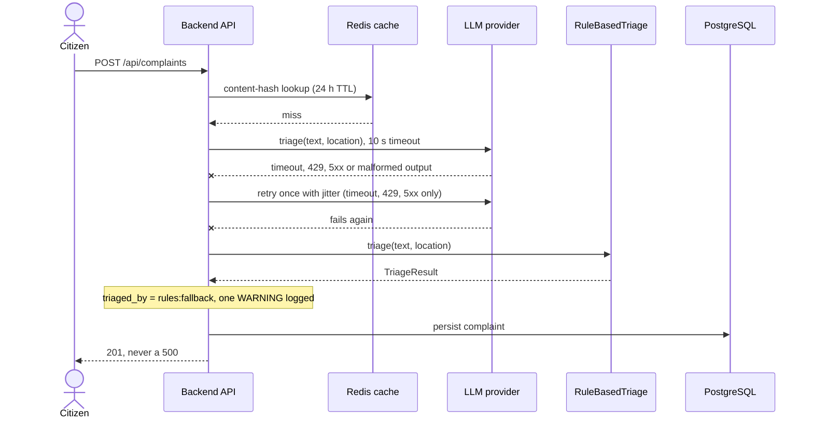

# Use Cases

Ten use cases of CivicPulse, each traced to the requirement IDs of [`ASSIGNMENT_TRACEABILITY.md`](ASSIGNMENT_TRACEABILITY.md). Behaviour comes from [`docx/ASSIGNMENT.md`](../docx/ASSIGNMENT.md); every alternate flow cites the section it comes from. Where the assignment does not say what happens, the use case says so and points at the design question in [`frs/api.md`](frs/api.md) instead of deciding. Detailed acceptance criteria live in the FR catalogs ([`FRs.md`](FRs.md)); this file is the story around them, so IDs are referenced, not restated.

**Actors** (from the PRD, §3): **Citizen**, **Operator**, **Triage provider**, **Platform automation** (CI/CD workflows, Kubernetes probes, HPA). The assignment defines no login or roles.

| # | Use case | Actor | Main IDs |
|---|---|---|---|
| UC-01 | Submit a complaint | Citizen | `ASG-FR-004…007`, `ASG-FR-020`, `ASG-FR-021`, `ASG-FR-037` |
| UC-02 | Triage a complaint | Triage provider | `ASG-AI-001…016`, `ASG-AI-019`, `ASG-AI-023` |
| UC-03 | Retrieve one complaint | Citizen, Operator | `ASG-FR-023` |
| UC-04 | Filter and page complaints | Operator | `ASG-FR-008`, `ASG-FR-024…026` |
| UC-05 | Change a complaint's status | Operator | `ASG-FR-009`, `ASG-FR-010`, `ASG-FR-027`, `ASG-FR-028`, `ASG-FR-034`, `ASG-FR-035` |
| UC-06 | View statistics | Operator | `ASG-FR-011`, `ASG-FR-012`, `ASG-FR-029`, `ASG-CACHE-002…006` |
| UC-07 | Rate-limit submissions | any client | `ASG-FR-022`, `ASG-CACHE-007…010` |
| UC-08 | Fall back when the AI provider fails | Triage provider | `ASG-AI-015`, `ASG-AI-021`, `ASG-AI-022`, `ASG-NFR-011` |
| UC-09 | Probe health and readiness | Platform automation | `ASG-FR-031`, `ASG-FR-032`, `ASG-K8S-016…018`, `ASG-NFR-008` |
| UC-10 | Deploy and roll back | Platform automation, engineer | `ASG-CICD-015…031`, `ASG-K8S-019`, `ASG-GEN-009` |

---

## UC-01 — Submit a complaint

- **Actor:** Citizen, through the Submit view (§2.1 p4).
- **Preconditions:** the backend, PostgreSQL and Redis are running (§1.2 p2, §2.2 p5).
- **Trigger:** the citizen submits the form: free-text complaint, location, optional contact (§2.1 p4).
- **Main flow:**
  1. The browser validates the input with rules that mirror the server's without replacing them (§2.1 p4; `ASG-FR-005`).
  2. The view shows an honest loading state while the request runs, because AI calls take seconds (§2.1 p4; `ASG-FR-007`).
  3. `POST /api/complaints`: rate limit (UC-07) → validate → triage (UC-02) → persist → invalidate the stats cache → **201** (§2.2 p5 "Validate → triage → persist. 201."; §2.4 p8).
  4. The view shows the returned category, priority, AI summary and which provider produced them (§2.1 p4; `ASG-FR-006`).
- **Alternate / failure flows:**
  - Invalid input → **400** with a field-level error body (§2.2 p5; §4 C p19). The format of that body is not specified (DQ-API-01, DQ-API-02).
  - Limit exceeded → **429** with `Retry-After` (§2.2 p5; §2.4 p8) — UC-07.
  - The provider fails or returns malformed output → the rule-based fallback decides and the answer is still 201 (§2.5 p11) — UC-08.
  - The same text was triaged before → one inference serves the duplicates (§2.5 p11, item 5) — UC-02.
- **Postconditions:** one new complaint exists with status `open` (the start of the state machine, §2.2 p6); the next `/api/stats` includes it immediately (§2.4 p8).
- **Traces:** `ASG-FR-004…007`, `ASG-FR-020`, `ASG-FR-021`, `ASG-FR-037`, `ASG-DATA-005…015`, `ASG-CACHE-005`, `ASG-NFR-010`.

## UC-02 — Triage a complaint

- **Actor:** the triage provider selected by `TRIAGE_PROVIDER` (§2.5 p9): `LLMTriage`, `OllamaTriage`, `RuleBasedTriage` or `SimulatedTriage`.
- **Preconditions:** the complaint text and location are available; a provider is configured (§2.5 p9).
- **Trigger:** UC-01 asks for a classification.
- **Main flow:**
  1. Look the text up in the Redis cache by content hash, 24 h TTL; a hit ends the flow with the stored result (§2.5 p11, item 5).
  2. Call the selected provider through the `TriageProvider` interface with a hard 10-second timeout, requesting structured output (§2.5 p9, p11 items 1–2).
  3. Validate the response against the `TriageResult` model: category and priority in their enums, summary ≤ 140 characters, confidence 0.0–1.0 (§2.5 p9, p11 item 1).
  4. Store the result in the cache, record `triage_latency_ms` and the provider (`triaged_by`), and return the result (§2.3 p7–8; §2.5 p11).
- **Alternate / failure flows:**
  - Timeout, 429 or 5xx → retry **once**, with jitter (§2.5 p11, item 3).
  - 400 from the provider → **never** retried; the request was wrong (§2.5 p11, item 3).
  - Malformed output — prose, a code fence, a category outside the enum, an over-long summary → rejected by the validator, never trusted (§2.5 p11, item 1) → UC-08.
  - Complaint text that tries to instruct the model ("ignore your instructions…") → the text is untrusted data; the output is constrained to the enum and anything outside it is rejected, so the category is still decided by the schema (§2.5 p11, item 7).
  - Model output is never evaluated as code and never used to build SQL (§2.5 p11, item 1).
- **Postconditions:** a valid `TriageResult` exists; `triaged_by` is one of `llm:groq`, `llm:ollama`, `rules`, `rules:fallback` (§2.3 p7). The value for `SimulatedTriage` and other hosted providers is not specified by the assignment; it is an open decision to be settled in Phase 02.
- **Traces:** `ASG-AI-001…016`, `ASG-AI-019`, `ASG-AI-023`, `ASG-DATA-013`.

## UC-03 — Retrieve one complaint

- **Actor:** Citizen or Operator (any HTTP client; the assignment defines no roles).
- **Preconditions:** the complaint exists, or does not.
- **Trigger:** `GET /api/complaints/{id}` (§2.2 p5).
- **Main flow:** the API answers **200** with the complaint.
- **Alternate / failure flows:** unknown id → **404** (§2.2 p5). A malformed id is not specified (DQ-API-06).
- **Postconditions:** nothing changes.
- **Traces:** `ASG-FR-023`, `ASG-FR-036`. The CI integration job depends on it: "POST a complaint, GET it back, assert the category" (§3.4 p17; `ASG-CICD-010`).

## UC-04 — Filter and page complaints

- **Actor:** Operator, through the Dashboard (§2.1 p4).
- **Preconditions:** complaints exist.
- **Trigger:** the operator opens the dashboard or changes a filter or page (§2.1 p4).
- **Main flow:** `GET /api/complaints` filtered by category, priority and status, paginated with `page` and `page_size`, and returns the total (§2.2 p6). The dashboard shows the paginated, filterable list (`ASG-FR-008`).
- **Alternate / failure flows:**
  - All three filters at once: the dashboard applies category, priority and status together (§2.1 p4).
  - `page_size` may not exceed 100 (§2.2 p6). What happens above 100, the defaults, the first page number, the sort order and what `total` counts are not specified (DQ-API-03); invalid filter values are not specified either (DQ-API-04).
- **Postconditions:** nothing changes.
- **Traces:** `ASG-FR-008`, `ASG-FR-024…026`.

## UC-05 — Change a complaint's status

- **Actor:** Operator, through the Dashboard (§2.1 p4).
- **Preconditions:** the complaint exists and has a status.
- **Trigger:** the operator advances the status: `PATCH /api/complaints/{id}/status` (§2.2 p6).
- **Main flow:** the transition table allows `open → in_progress → resolved`, `open → rejected` and `in_progress → rejected`; an allowed transition is applied (§2.2 p6). The transition table is explicit data, not a chain of ifs (§2.2 p6; §4 C p20).
- **Alternate / failure flows:**
  - Any other transition → **409** naming the attempted transition (§2.2 p6).
  - `resolved` and `rejected` are terminal: every change from them is a 409 (§2.2 p6, "Everything else is 409").
  - The dashboard shows the server's 409 message, not a generic "error" (§2.1 p4; §4 B p19), and decides nothing itself about which transitions are valid (§2.1 p4).
  - The success status and body, and the behaviour for an unknown id, the same status or an unknown status value are not specified (DQ-API-16, DQ-API-17, DQ-API-18).
- **Postconditions:** the status is the new one, or unchanged after a 409.
- **Traces:** `ASG-FR-009`, `ASG-FR-010`, `ASG-FR-027`, `ASG-FR-028`, `ASG-FR-034`, `ASG-FR-035`.

## UC-06 — View statistics

- **Actor:** Operator, through the Stats view (§2.1 p4).
- **Preconditions:** the backend and Redis are running.
- **Trigger:** `GET /api/stats` (§2.2 p6).
- **Main flow:**
  1. The first request is computed from the database, stored in Redis with a 30-second TTL and answered with `X-Cache: MISS` (§2.4 p8, Job 1).
  2. A request within 30 seconds is served from Redis with `X-Cache: HIT` (§2.4 p8).
  3. The view shows the aggregate counts by category and priority, and whether the response was a cache hit (§2.1 p4; `ASG-FR-011`, `ASG-FR-012`).
- **Alternate / failure flows:**
  - A new complaint is submitted → the cache is invalidated on write, so the next request is a MISS that counts it, not up to 30 seconds later (§2.4 p8).
  - The TTL expires → the next request is a MISS (§2.4 p8).
  - The shape of the body and whether a status change invalidates the cache are not specified (DQ-API-07); the behaviour when Redis is down is not specified (DQ-API-15).
- **Postconditions:** nothing changes except the cache.
- **Traces:** `ASG-FR-011`, `ASG-FR-012`, `ASG-FR-029`, `ASG-CACHE-002…006`.

## UC-07 — Rate-limit submissions

- **Actor:** any client of `POST /api/complaints` (a citizen, or "one bored user with a for loop", §2.4 p8).
- **Preconditions:** Redis is running.
- **Trigger:** a request reaches `POST /api/complaints`.
- **Main flow:** a fixed-window or token-bucket counter in Redis, keyed by client IP, admits the request while the caller is within the limit (§2.4 p8, Job 2).
- **Alternate / failure flows:**
  - Limit exceeded → **429** with a `Retry-After` header (§2.2 p5; §2.4 p8).
  - The counter lives in Redis, not in an in-process dictionary, so it still holds when the HPA scales the backend to several pods (§2.4 p8).
  - The threshold, the window, how the client IP is determined behind the Ingress and the order of the limiter and the validation are not specified (DQ-API-09, DQ-API-10); neither is the behaviour when Redis is unavailable (DQ-API-15).
- **Postconditions:** the counter for that IP is updated; an admitted request proceeds to UC-01.
- **Traces:** `ASG-FR-022`, `ASG-CACHE-007…010`.

## UC-08 — Fall back when the AI provider fails

- **Actor:** the triage provider (the citizen does not notice).
- **Preconditions:** `RuleBasedTriage` is always available and never fails (§2.5 p9).
- **Trigger:** during UC-02 the provider times out (10 s), is rate-limited (429), answers 5xx, raises, or returns output that fails validation, and the single jittered retry (where it applies) did not help (§2.5 p11, items 1–3).
- **Main flow:**
  1. The service falls back to `RuleBasedTriage` (§2.5 p11, item 4).
  2. The complaint is recorded with **`triaged_by = "rules:fallback"`** (§2.5 p11, item 4).
  3. One WARNING is logged with the complaint id, the provider and the error class (§2.2 p7; `ASG-NFR-011`).
  4. The request continues and the API answers **201**: **the user never sees a 500** because a third party was rate-limited (§2.5 p11, item 4).
- **Alternate / failure flows:**
  - A 400 from the provider is not retried (§2.5 p11, item 3); the fallback rule of item 4 applies.
  - The test the assignment asks for "if you write no other": with a provider that always raises, `POST /api/complaints` still returns 201 and `triaged_by == "rules:fallback"` (§2.5 p12). CI pins `SimulatedTriage`, injects an always-raising provider for the fallback and a malformed-JSON provider for the validator (§2.5 p12).
- **Postconditions:** the complaint is stored with a valid category and priority decided by the rules; the fallback counter and the triage latency are recorded (`/metrics`, §2.2 p6).
- **Traces:** `ASG-AI-015`, `ASG-AI-021`, `ASG-AI-022`, `ASG-NFR-011`, `ASG-FR-033`.

## UC-09 — Probe health and readiness

- **Actor:** Platform automation: the Kubernetes probes and the Compose healthchecks (§2.2 p6; §3.2 p13; §3.3 p15).
- **Preconditions:** the backend process is running.
- **Trigger:** a probe calls `GET /health` or `GET /ready` (§2.2 p6).
- **Main flow:**
  - `/health` is liveness: the process is alive, and it **must not touch the database** (§2.2 p6).
  - `/ready` is readiness: **200** only if PostgreSQL and Redis are both reachable (§2.2 p6).
  - A startup probe calls `/health` on port 8000 with `failureThreshold: 30` and `periodSeconds: 2` (§3.3 p15).
- **Alternate / failure flows:**
  - A dependency is unreachable → `/ready` answers **503 naming the failed dependency** (§2.2 p6), while `/health` still answers because it does not touch the database (§2.2 p6).
  - A failing liveness probe **restarts the pod**; a failing readiness probe **removes it from the Service**. Wired backwards, a slow database becomes a restart loop across the deployment (§2.2 p6).
  - On SIGTERM the process stops accepting new requests, finishes in-flight ones, closes its pool connections and exits (§2.2 p7; `ASG-NFR-008`).
  - The response bodies and the dependency timeouts are not specified (DQ-API-11).
- **Postconditions:** nothing changes in the data.
- **Traces:** `ASG-FR-031`, `ASG-FR-032`, `ASG-K8S-016…018`, `ASG-DEVOPS-021`, `ASG-NFR-008`.

## UC-10 — Deploy and roll back

- **Actor:** Platform automation (the `cd.yml` workflow) and the engineer who undoes a bad deploy (the assignment names no role for them).
- **Preconditions:** a change is pushed to `main`, which is protected: required checks and one approval (§3.4 p17).
- **Trigger:** a push to `main` runs `cd.yml` (§3.4 p18).
- **Main flow:**
  1. `test` runs the full suite on the merged result.
  2. `build-push` (needs `test`) builds both images, pushes them to GHCR tagged with `${{ github.sha }}` and `latest`, emits an SBOM and captures the image digest.
  3. `deploy-k8s` (needs `build-push`) starts a kind or k3d cluster in the runner, applies `overlays/prod` **with the SHA tag**, waits for `kubectl rollout status`, runs a smoke test against the Ingress and prints `kubectl get hpa` (§3.4 p18).
  4. The rolling update uses `maxSurge: 1` and `maxUnavailable: 0` (§3.3 p15).
- **Alternate / failure flows:**
  - A failing test stops publishing and deploying, because every publishing and deploying job has `needs:` (§3.4, non-negotiables).
  - `:latest` may be pushed but is never deployed; production is identified by an immutable reference, the commit SHA (§3.4, non-negotiables).
  - **Rollback, mechanism 1:** `kubectl rollout undo deployment/backend -n civicpulse` — fast and imperative (§3.4 p18).
  - **Rollback, mechanism 2:** re-apply the previous overlay with the previous SHA — declarative and auditable (§3.4 p18–19).
  - Both are demonstrated on video with an explanation of when to use each (§3.4 p19), and a bad deploy can be undone in thirty seconds (§1.4 p3).
- **Postconditions:** the cluster runs the new SHA, or the previous one after a rollback.
- **Traces:** `ASG-CICD-015…031`, `ASG-K8S-019`, `ASG-GEN-009`, `ASG-CICD-023`, `ASG-CICD-028…031`.

---

## Coverage

| Use case | FR IDs | NFR IDs | Source sections |
|---|---|---|---|
| UC-01 | FR-004…007, 020, 021, 037 | NFR-010 | §1.2, §2.1, §2.2, §2.4 |
| UC-02 | (AI-001…016, 019, 023) | NFR-012, NFR-015 (tests) | §2.3, §2.5 |
| UC-03 | FR-023, 036 | — | §2.2, §3.4 |
| UC-04 | FR-008, 024…026 | — | §2.1, §2.2 |
| UC-05 | FR-009, 010, 027, 028, 034, 035 | — | §2.1, §2.2, §4 |
| UC-06 | FR-011, 012, 029 | — | §2.1, §2.2, §2.4 |
| UC-07 | FR-022 | — | §2.2, §2.4 |
| UC-08 | FR-033 | NFR-011 | §2.2, §2.5 |
| UC-09 | FR-031, 032 | NFR-008 | §2.2, §3.2, §3.3 |
| UC-10 | — | (CICD, K8S) | §1.4, §3.3, §3.4 |
