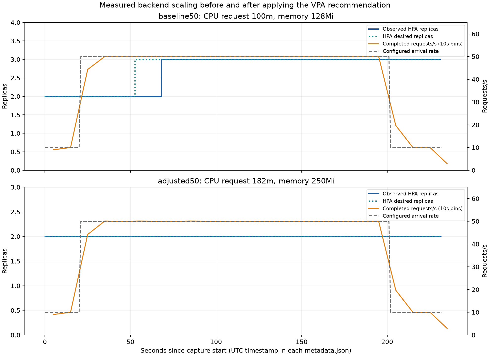

# Local Kubernetes load experiment (#50)

Requirements: ASG-K8S-012..014, 021, 023..030; ASG-REPO-012.

## Environment and setup

This experiment runs on Artfever's Windows machine, with Docker Desktop's WSL 2 Linux engine,
kind v0.33.0 and Kubernetes v1.37.0. Exact client/server versions and a real `kubectl top nodes`
capture are in `k8s-load-environment.txt`. The Docker data disk was copied and SHA256-verified on
D: because C: had insufficient space; an NTFS junction preserves Docker's original disk path.
That storage workaround is specific to this machine, not an application requirement.

The isolated local cluster is `kind-civicpulse`. Installed upstream manifests:

- metrics-server v0.9.0: `https://github.com/kubernetes-sigs/metrics-server/releases/download/v0.9.0/components.yaml`
- VPA v1.8.0: `vpa-v1-crd-gen.yaml`, `vpa-rbac.yaml` and `recommender-deployment.yaml` under
  `https://raw.githubusercontent.com/kubernetes/autoscaler/vertical-pod-autoscaler-1.8.0/vertical-pod-autoscaler/deploy/`

Apply those files with `kubectl --context kind-civicpulse apply -f <downloaded-file>`.
On this kind cluster, metrics-server needs `--kubelet-insecure-tls` appended to its container args
because the local kubelet certificate is not trusted by it. This exception is for the local test
cluster only. Only the VPA recommender Deployment is installed: no updater or admission controller
is needed to mutate pods, since the VPA object has `updateMode: Off`.

The manifests in `k8s/overlays/dev` were applied after creating a random database password in
`civicpulse-secrets` through stdin. No secret value or rendered Secret was saved as evidence.
The provider is `rules`; `python -m app.seed` was executed once inside a backend pod and inserted
30 deterministic complaints. Application images were built from source commit `b442e8d` and
loaded with `kind load docker-image ... --name civicpulse`.

## Measurement method

`load/k6-script.js` alternates complaint-list and stats GET requests. It never loops POST, whose
distributed rate limiter would instead measure 429 responses. The workload uses an arrival-rate
executor: 20 seconds at 10 requests/s, a one-second rise to 50, 180 seconds at 50, a one-second
fall, then 30 seconds at 10. These are experimental load choices, not assignment requirements.

Run k6 inside the cluster (pinned `grafana/k6:2.2.0`) through the `frontend` ClusterIP Service and
nginx proxy, which forwards each API request to the backend Service. This avoids tunnelling load
through the Kubernetes API server and Windows port-forward. The capture helper creates a temporary
ConfigMap and Pod, records the unedited HPA watch, samples HPA and Deployment status every five
seconds, and retains k6's log and summary. `requests-per-10s.csv` is derived from actual `http_reqs`
JSON points; raw per-request JSON is kept outside Git in `D:\CivicPulse-ops`, with its SHA256 in
each run's metadata. The chart labels configured arrival rate separately from completed requests.

```powershell
python docs/evidence/k8s-load-capture.py baseline50 --raw-dir D:\CivicPulse-ops --rate 50 --rollout-image civicpulse-backend:rollout-b442e8d
```

The rollout at about 70 seconds uses a second tag of the **same application image digest**. It
tests pod replacement and connection draining, not a change in business behavior. The command
output and timestamp are captured; the test requires zero failed HTTP requests and zero dropped
iterations. Before each comparable run the HPA is recreated, the backend is reset to two replicas
and the `dev` image, and its rollout is allowed to finish. This avoids carrying the 300-second
scale-down history into the next experiment.

## Failed setup attempts (retained)

- `k8s-load-initial`: native Windows k6 at 300 requests/s through `kubectl port-forward` lost its
  tunnel. The load process was stopped; its exit code was 4294967295. Its verbose raw log is
  gzip-compressed without changing the contents. This is not zero-downtime evidence.
- `k8s-load-baseline`: 300 requests/s inside the cluster exhausted 500 k6 VUs while the initial
  two backend pods were CPU-limited. The run was interrupted (k6 exit 105). This is a failed
  stress attempt, not the comparison run. Before the 50-request/s baseline, the VPA object and
  its checkpoint were removed and the recommender restarted to clear that attempt's history.

## Results

The baseline (`k8s-load-baseline50`) completed 9,559 requests, with zero HTTP failures, zero
dropped iterations and p95 request latency 6.25 ms. HPA desired replicas increased from 2 to 3.
The captured `set-image.txt` and `rollout-status.txt` show a successful rolling replacement during
that same traffic. These text artifacts do not claim that the required video has been recorded.

### VPA loop

Initial requests: CPU `100m`, memory `128Mi`. The unedited baseline `vpa.txt` records:

| Recommendation | CPU | Memory |
|---|---:|---:|
| Lower bound | 36m | 250Mi |
| Target | 182m | 250Mi |
| Upper bound | 85642m | 51675002177 bytes |

The very broad upper bound comes from a short observation window and is **not** a resource
allocation or a measured capacity claim. We applied the **Target**, `182m` / `250Mi`, to the
backend container in `k8s/base/backend.yaml` and kept its `500m` / `256Mi` limits. The second run
uses the same workload and rollout timing. Longer representative traffic would be needed before
using this experiment as production sizing advice.

The adjusted run (`k8s-load-adjusted50`) completed 9,559 requests with zero HTTP failures,
zero dropped iterations and p95 latency 6.49 ms. Desired replicas stayed at 2 throughout,
compared with 2 to 3 in the baseline. Increasing the CPU request changes the HPA utilization
denominator; this short experiment demonstrates that behavior, not a latency improvement.
Any temporary extra pod during the adjusted rollout is rolling-update surge, not an increase
in HPA desired capacity. Both runs report successful rollouts while serving traffic.



Regenerate the chart with `python docs/evidence/k8s-load-plot.py` in an environment with
matplotlib installed. It reads only the committed captures. The second capture command was:

```powershell
python docs/evidence/k8s-load-capture.py adjusted50 --raw-dir D:\CivicPulse-ops --rate 50 --rollout-image civicpulse-backend:rollout-b442e8d
```

### Measured lag (ASG-K8S-027)

The configured load starts rising at 20 seconds; the first sampled desired count of 3 is at
52.53 seconds, and the third Ready backend appears at 57.77 seconds (about 38 seconds of capacity
lag). HPA's reported current count reaches 3 at 68.26 seconds, about 48 seconds after the load
step, with a five-second sampling interval and roughly one second of load-process startup
uncertainty. Metrics collection, the HPA control-loop interval, pod creation and readiness all
contribute to this delay, although this capture does not isolate each contribution. Faster
sampling/control loops could reduce part of the delay at a control-plane cost; keeping enough
baseline capacity avoids relying on reactive scaling for immediate demand.

### Why VPA stays Off (ASG-K8S-030)

HPA divides observed CPU usage by the CPU request. If VPA automatically raises that request,
utilization falls and HPA may remove replicas; the remaining replicas then receive more work,
which may cause VPA to raise requests again. `Off` lets the recommender collect data while a
human-reviewed change controls the denominator; HPA remains the automatic replica controller.
